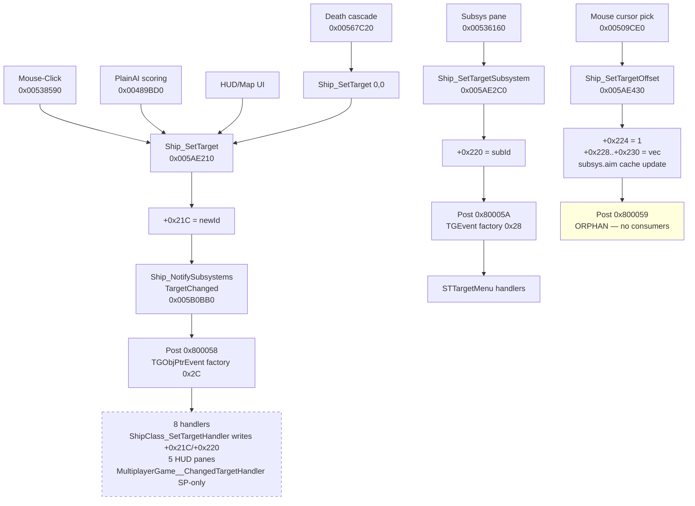

> [docs](../README.md) / [gameplay](README.md) / targeting-system.md

---
title: Ship Targeting State Machine
type: reference
audience: re-engineer
validated: 2026-05-28
methodology: FUNCTION_DOC_WORKFLOW_V5
binary:
  name: stbc.exe
  size: 6394712
  base: 0x00400000
status: verified
evidence:
  - claim: "Ship targeting fields: +0x21C target_id, +0x220 target_subsys, +0x224 manual_aim, +0x228..+0x230 target_offset (TGPoint3)"
    address: 0x005AB970
    function: Ship_InitTargetState
    completeness: high
    confidence: high
    note: "Byte-confirmed via Ship_InitTargetState ctor init sequence: MOV [param+0x21C]=0, [+0x220]=0, [+0x224]=0, [+0x228]=DAT_009a2878, [+0x22C]=DAT_009a287c, [+0x230]=DAT_009a2880. DAT_009a2878..0x880 is the world-center origin sentinel."
  - claim: "Ship_SetTarget — primary state mutator for +0x21C"
    address: 0x005AE210
    function: Ship_SetTarget
    completeness: high
    confidence: high
    note: "Conditional on getTarget() != newTarget; posts event 0x800058 via TGObjPtrEvent (factory 0x2C); calls Ship_NotifySubsystemsTargetChanged BEFORE event post."
  - claim: "Ship_SetTargetOffset (suspected at 0x005AE430 — post site for event 0x800059)"
    address: 0x005AE430
    function: Ship_SetTargetOffset
    completeness: high
    confidence: high
    note: "Post site at 0x005ae57c writes +0x224 manual flag, +0x228..+0x230 offset vec; cascades to subsystem aim cache (+0x40..+0x4C) via ship+0x284 walk."
  - claim: "Ship_CycleNextTarget at 0x005AE6D0 uses +0x21C as cursor seed (NOT a separate cycle index)"
    address: 0x005AE6D0
    function: Ship_CycleNextTarget
    completeness: high
    confidence: high
    note: "Reads ship+0x21C at 0x005ae6e0. Explains the historical '+0x87 fabricated' lingering claim: 0x87 * 4 = 0x21C, array-indexed access to the same target field, used AS the linked-list cursor seed. Re-classified from 'fabricated' to 'anchored to +0x21C as cursor'."
  - claim: "ShipClass_SetTargetHandler at 0x005B0E00 — the actual state mutator that writes +0x21C/+0x220 from event payload"
    address: 0x005B0E00
    function: ShipClass_SetTargetHandler
    completeness: high
    confidence: high
    note: "Newly named this pass. Registered for event 0x800058 (ALWAYS active). Writes ship+0x21C and ship+0x220 from event payload. Created as function this pass (was a LAB_)."
  - claim: "DEAD_Ship_SaveCheckpoint at 0x005B0FA0 — cut savegame serializer, zero callers"
    address: 0x005B0FA0
    function: DEAD_Ship_SaveCheckpoint
    completeness: high
    confidence: high
    note: "Spans 0x005b0fa0–0x005b1320. Writes +0x21C/+0x220/+0x224/+0x1F8/.../+0x2F8 via vtable[+0x84] (stream serializer). search_byte_patterns A0 0F 5B 00 returns NO matches; no DATA xref. Dead code — likely cut savegame/checkpoint feature."
  - claim: "MultiplayerGame::ChangedTargetHandler at 0x006A1A70 — DOUBLE-GATED SP-only"
    address: 0x006A1A70
    function: MultiplayerGame__ChangedTargetHandler
    completeness: high
    confidence: high
    note: "Gate 1: in-function check `if (DAT_0097fa8a == '\\0')` — SP-only. Gate 2: registration gate at MultiplayerGame_Ctor 0x0069ea5b — handler is NOT registered in MP. Sends opcode 0x0D via SendEventMessage when both gates pass (SP only)."
  - claim: "Event 0x800058 TARGET_WAS_CHANGED — post site byte-confirmed in Ship_SetTarget"
    address: 0x005AE27A
    function: Ship_SetTarget
    completeness: high
    confidence: high
    note: "Bytes `c7 46 10 58 00 80 00` = `MOV [ESI+0x10], 0x800058` on TGObjPtrEvent (factory ID 0x2C). 8 handlers registered via FUN_006da130 for DAT_00800058. Network relay: NONE in MP."
  - claim: "Event 0x800059 TARGET_OFFSET_CHANGED — orphan event, post site in Ship_SetTargetOffset, ZERO consumer handlers"
    address: 0x005AE57C
    function: Ship_SetTargetOffset
    completeness: high
    confidence: high
    note: "Bytes `c7 46 10 59 00 80 00` = `MOV [ESI+0x10], 0x800059` on TGEvent (factory 0x28). Xref search to 0x00800059 returns ONLY the post site itself. Event is emitted but has no consumers in the stripped binary."
  - claim: "Event 0x80005A TARGET_SUBSYSTEM_SET — post sites in Ship_SetTargetSubsystem + STTargetMenu"
    address: 0x005AE40B
    function: Ship_SetTargetSubsystem
    completeness: high
    confidence: high
    note: "Primary post site bytes `c7 47 10 5a 00 80 00` = `MOV [EDI+0x10], 0x80005A` on TGEvent (factory 0x28). Secondary post at 0x00537dc1 (STTargetMenu UI sync). Never appears in MultiplayerGame's handler registration list."
  - claim: "Ship__WriteStateUpdate (FUN_005B17F0) accesses ZERO target fields — proves NOT-replicated"
    address: 0x005B17F0
    function: Ship__WriteStateUpdate
    completeness: high
    confidence: high
    note: "Negative claim. Full 348-line body decompiled, all 8 dirty-flag branches (0x01/0x02/0x04/0x08/0x10/0x20/0x40/0x80) inspected. Zero reads of +0x21C, +0x220, +0x224, +0x228, +0x22C, +0x230. Receiver FUN_005B21C0 (190 lines) also reads none of these fields."
  - claim: "MultiplayerGame_Ctor gate at 0x0069EA5B controls ChangedTargetHandler registration"
    address: 0x0069EA5B
    function: MultiplayerGame_Ctor
    completeness: high
    confidence: high
    note: "Gate BEFORE `FUN_006db380(&DAT_00800058, ...)` — the handler is unregistered in MP. Combined with the in-handler SP-only branch this is the double-gate that proves target-change messages never relay over MP."
companions:
  - docs/gameplay/ship-navigation.md
  - docs/gameplay/weapon-firing-mechanics.md
  - docs/protocol/stateupdate-subsystem-wire-format.md
  - docs/protocol/stateupdate.md
  - docs/engine/event-system-architecture.md
  - docs/protocol/v5-validation-status.md
supersedes:
  - (prior coverage in ship-navigation.md §Targeting was brief; this doc replaces it)
---

# Ship Targeting State Machine

> [!NOTE]
> **Target state is NOT replicated on the wire.** Each client manages its own
> targeting locally. `Ship__WriteStateUpdate` (host emission) and
> `Ship__ReadStateUpdate` (client receive) both access zero of the 6 target
> fields. `MultiplayerGame::ChangedTargetHandler` is double-gated SP-only
> (the in-function `DAT_0097fa8a` check AND the MultiplayerGame_Ctor
> registration gate at 0x0069EA5B). The cut feature `DEAD_Ship_SaveCheckpoint`
> at 0x005B0FA0 is a savegame serializer that writes all 6 target fields via
> `vtable[+0x84]` — has ZERO callers, dead code. **Useful for OpenBC: zero work
> needed for targeting replication.**

Full reverse-engineering of the Ship class targeting subsystem in stbc.exe.
Covers field layout, all 13 producer/consumer functions, the 3 confirmed events
(plus a 4th unverified click-target event), and the byte-level proof that target
state is never transmitted in the multiplayer protocol.

## 1. Field Layout

All 6 target fields live in the Ship class at +0x21C..+0x230, byte-confirmed
via `Ship_InitTargetState` (0x005AB970).

| Offset | Size | Type | Name | Init value | Notes |
|--------|------|------|------|-----------|-------|
| +0x21C | 4 | u32 | `targetId` | 0 | TGSceneObject network ID (target obj's +0x4); 0 = no target |
| +0x220 | 4 | u32 | `targetSubsystemId` | 0 | Subsystem network ID; 0 = whole-ship target |
| +0x224 | 1 | u8 | `manualAimFlag` | 0 | 0 = auto-aim (lazy-sync to target pos); 1 = manual-aim (cursor in space) |
| +0x225..+0x227 | 3 | — | padding | — | struct align |
| +0x228 | 4 | f32 | `targetOffsetX` | DAT_009a2878 | Auto: tracks target pos via vtable+0x94; Manual: cursor world-x |
| +0x22C | 4 | f32 | `targetOffsetY` | DAT_009a287c | (see above) |
| +0x230 | 4 | f32 | `targetOffsetZ` | DAT_009a2880 | (see above) |

`Ship_InitTargetState` (0x005AB970) byte sequence:

```
MOV [param+0x21C], 0
MOV [param+0x220], 0
MOV [param+0x224], 0
MOV [param+0x228], DAT_009a2878
MOV [param+0x22C], DAT_009a287c
MOV [param+0x230], DAT_009a2880
```

`DAT_009a2878/7C/80` is the global "world center" origin sentinel used as the
default offset when no target is set. Same constant block is referenced by
`Ship_GetTargetOffsetVec` (0x005AE650) on its fall-through path.

Fields +0x234..+0x248 are adjacent but belong to a separate (likely
navigation/autopilot) block — see [ship-navigation.md](ship-navigation.md).

## 2. State Machine

Five public operations plus an internal init. Each operation either writes
target fields directly or wraps one that does.

### Producers (write +0x21C / +0x220 / +0x224 / +0x228..+0x230)

| Function | Address | Writes | Posts event | Notes |
|----------|---------|--------|-------------|-------|
| Ship_SetTarget | 0x005AE210 | +0x21C, then calls SetSubsystem | 0x800058 (TGObjPtrEvent factory 0x2C) | Hub; conditional on `getTarget() != newTarget` |
| Ship_SetTargetSubsystem | 0x005AE2C0 | +0x220, calls SetOffset(0,0) | 0x80005A (TGEvent factory 0x28) | Drives FUN_00585580 4x (weapon-style retargeting) |
| Ship_SetTargetOffset | 0x005AE430 | +0x224, +0x228..+0x230 | 0x800059 (TGEvent factory 0x28) | Manual=1+vec OR auto=0(zero vec); cascades to subsystem aim cache |
| Ship_GetTargetObject | 0x005AE170 | clears +0x21C if stale | none | Resolves targetId via TGSceneGraph_GetObjectByID; auto-clears bad/missing |
| Ship_SetTargetByObjectHandle | 0x005AE1B0 | (via SetTarget) | (via SetTarget) | Public wrapper — resolves handle in scene graph first |
| Ship_SetTargetByName | 0x005AE1E0 | (via SetTarget) | (via SetTarget) | Public wrapper — uses FUN_00434E70 (string -> obj lookup) |
| Ship_CycleNextTarget | 0x005AE6D0 | (via SetTarget) | (via SetTarget) | Walks scene-set linked list; seeds cursor from CURRENT target (ship+0x21C); filters via vtable+0xCC (IsValidTargetCandidate) |
| Ship_InitTargetState | 0x005AB970 | ALL 6 = init values | none | Called from Ship ctor |
| Ship_NotifySubsystemsTargetChanged | 0x005B0BB0 | NONE (dispatches only) | none | Called by Ship_SetTarget BEFORE event post; walks ship+0x284 sub-list, calls subsys.vtable+0x90 (OnTargetChanged) |

### Consumers (read +0x21C, non-dead)

| Function | Address | Role |
|----------|---------|------|
| Ship_GetTargetObject | 0x005AE170 | resolver/getter — direct read with auto-clear |
| Ship_SetTargetSubsystem | 0x005AE2C0 | compares against new subsys id (read at 0x005ae2f7) |
| Ship_SetTargetOffset | 0x005AE430 | iterates subsys aim cache (reads at 0x005ae4cb, 0x005ae507) |
| Ship_CycleNextTarget | 0x005AE6D0 | uses targetId as iterator cursor (read at 0x005ae6e0) |
| ShipClass_SetTargetHandler | 0x005B0E00 | event handler (0x800058) — WRITES +0x21C, +0x220 from event payload |
| CollisionRateLimit (FUN_005A22A0) | 0x005A22A0 | Ship vtable+0x13C cooldown gate — reads via Ship_GetTargetObject to check "am I targeting attacker" |
| FUN_00489BD0 | 0x00489BD0 | PlainAI scoring — reads OTHER ships' targets ("is another ship targeting me?") |
| FUN_00538590 | 0x00538590 | Mouse-LeftClick TargetObject handler |
| FUN_00538FC0 | 0x00538FC0 | Mouse-LeftClick TargetSubsystem handler (also posts 0x80005B) |
| FUN_00567C20 | 0x00567C20 | Ship death/exit-scene handler — clears target if just-died non-friendly |
| FUN_00536160 | 0x00536160 | Subsystem-list select handler |
| FUN_00509CE0 | 0x00509CE0 | Mouse-cursor/HUD pick — calls Ship_SetTargetOffset(1, &vec) — manual aim path |

### Transition diagram



## 3. Events

### Event 0x800058 — TARGET_WAS_CHANGED

- **Post site (sole)**: `0x005AE27A` in `Ship_SetTarget`. Bytes `c7 46 10 58 00 80 00` = `MOV [ESI+0x10], 0x800058`.
- **Event class**: TGObjPtrEvent (factory ID 0x2C from `FUN_00717b70(0x2C)`). `evt+0x28` = newTargetId.
- **Handlers** (8 total, registered via `FUN_006da130` for `&DAT_00800058`):
  - `MultiplayerGame::ChangedTargetHandler` at `0x006A1A70` — SP-ONLY (see §5).
  - `ShipClass_SetTargetHandler` at `0x005B0E00` — ALWAYS active; writes ship+0x21C and ship+0x220 from event payload.
  - `MapWindow::TargetChangedHandler` at `0x004FE560` — starmap update.
  - `STTargetMenu::TargetChanged` at `0x00537BE0` — target-info panel.
  - `FUN_0054B2F0`, `FUN_0054B6E0`, `FUN_00547B10`, `FUN_00546DC0` — additional HUD panes.
- **Network relay**: NONE in multiplayer (see §5).

### Event 0x80005A — TARGET_SUBSYSTEM_SET

- **Post sites (2)**:
  - `0x005AE40B` in `Ship_SetTargetSubsystem`. Bytes `c7 47 10 5a 00 80 00` = `MOV [EDI+0x10], 0x80005A`.
  - `0x00537DC1` in `STTargetMenu::TargetedSubsystemChanged` (UI sync path).
- **Event class**: TGEvent (factory 0x28 from `FUN_00717b70(0x28)` + `FUN_006d5c00(0)`).
- **Handlers**: 1+ in `STTargetMenu` ctor (FUN_00537BE0 line `FUN_006db380(&DAT_0080005a, ...)`).
- **Network relay**: NONE. Never appears in MultiplayerGame's handler registration table (FUN_0069EFE0).

### Event 0x800059 — TARGET_OFFSET_CHANGED (orphan)

- **Post site (sole)**: `0x005AE57C` in `Ship_SetTargetOffset`. Bytes `c7 46 10 59 00 80 00` = `MOV [ESI+0x10], 0x800059`.
- **Event class**: TGEvent (factory 0x28).
- **Handlers**: **ZERO** via `FUN_006da130` / `FUN_006db380` string-binding. Xref search to `0x00800059` returns ONLY the post site itself.
- Event is **emitted but has no consumers** in the stripped binary. Likely dead post or expected to be wired from Python (no Python handler observed either). See §4 for the implication.

### (Bonus) Event 0x80005B — TARGET_SUBSYSTEM_FROM_CLICK

- **Post site (sole)**: `0x005390A2` in `FUN_00538FC0` (Mouse-LeftClick on subsystem). TGEvent factory 0x28.
- **Handlers**: 1 — `FUN_0054B6E0` (subsystem pane) registers it.
- **Not in the SetTarget cascade** — it's a UI-click notification, recorded for completeness only. Naming inferred; confidence medium.

## 4. Event 0x800059 is Orphan

`Ship_SetTargetOffset` (0x005AE430) posts event `0x800059` (TARGET_OFFSET_CHANGED) at `0x005AE57C` after writing the manual-aim flag and offset vector. **Nothing in the binary consumes it.**

Why this matters:

- The offset change is still visible to weapons — `Ship_SetTargetOffset` directly walks `ship+0x284` and writes `subsys.aim+0x40..+0x4C` for each weapon subsystem whose locked target matches `ship+0x21C`. Weapons get the new aim by direct cache write, not by event broadcast.
- A HUD pane wanting to redraw a manual aim reticle would need this event — but no such handler is registered. Either an unshipped feature or a Python-side expectation that the stock scripts never wire up.

If OpenBC implements manual-aim feedback (e.g. a reticle that follows the cursor), it must drive its own HUD update path; the stock binary's event broadcast for offset changes goes nowhere.

## 5. Network Behavior — NOT REPLICATED

**Ship targeting state (+0x21C target, +0x220 subsys, +0x224 manual, +0x228..0x230 offset) is NOT serialized on the wire.**

### Byte-confirmed proof

**Not in StateUpdate (opcode 0x1C)** — Full body of `Ship__WriteStateUpdate` (0x005B17F0, 348 lines, all 8 dirty-flag branches 0x01 / 0x02 / 0x04 / 0x08 / 0x10 / 0x20 / 0x40 / 0x80) read; `Ship__ReadStateUpdate` (0x005B21C0, 190 lines) also read. **Zero reads of +0x21C, +0x220, +0x224, +0x228, +0x22C, +0x230 in either function.** The 8 flag payloads cover position absolute, position delta, forward, up, speed, cloak, subsystem health, weapon health. No target field, no aim cursor.

**No dedicated opcode** — The 41-entry MpgameHandleMessage jump table at `0x0069F534` was v5-validated in protocol mid #7 (game-opcodes.md). No entry routes to target state.

**No PythonEvent shipment in MP** — `MultiplayerGame::ChangedTargetHandler` at `0x006A1A70` sends opcode 0x0D (PythonEvent2) via SendEventMessage, but the handler is **double-gated SP-only**:

1. **In-function gate**: `if (DAT_0097fa8a == '\0')` short-circuits in MP.
2. **Registration gate**: `MultiplayerGame_Ctor` at `0x0069EA5B` guards the `FUN_006db380(&DAT_00800058, ...)` registration call — the handler is **NOT registered** in MP at all.

Either gate alone would prevent target-change transmission; both gates together make it unreachable.

**The "Save/Restore" path** (`DEAD_Ship_SaveCheckpoint` at `0x005B0FA0`) DOES serialize all 6 target fields via `vtable[+0x84]` writes — but this function has **ZERO callers** in stbc.exe (`search_byte_patterns A0 0F 5B 00` returns no matches; no DATA xref). Almost certainly cut savegame code. Not a network replication path. See §6.

### Implication for HUD overlays

Other players' targets are NOT visible on the wire. Any HUD element that shows "X is targeting Y" must derive that from observed firing events — opcode 0x07 (StartFiring) carries a target field as a side channel.

This matches stock-dedi behavior: spectator HUD shows a targeted ship's name only for ships YOU CAN SEE BEING FIRED ON, not via target-state replication.

## 6. Cut Feature: DEAD_Ship_SaveCheckpoint

`DEAD_Ship_SaveCheckpoint` at `0x005B0FA0` (spans `0x005B0FA0`–`0x005B1320`,
created as a function this pass) is a full-state serializer that writes ship
state to a stream via `vtable[+0x4C/0x6C/0x74/0x84]`:

- `+0x21C` written at `0x005B0E19`
- `+0x220` written at `0x005B0E23`
- `+0x1F8` written at `0x005B1032`
- `+0x224..+0x230` (target block) written at `0x005B1054`
- Trailing block ending at `0x005B1316`

**Zero callers** — both `search_byte_patterns A0 0F 5B 00` (the call-target encoding) and the DATA-xref search return empty. The function compiles cleanly and links into the binary but is never invoked.

Almost certainly a cut savegame/checkpoint feature. **Do NOT cite this code as evidence for active behavior** — earlier RE notes that referenced "Ship state serialization" hits here were following dead code. This validation pass is the reason it now carries the `DEAD_` prefix.

Worth a cross-link to [cut-content-analysis.md](../analysis/cut-content-analysis.md) when that doc is next refreshed.

## 7. Weapon System Integration

Weapons learn of target changes via direct dispatch, not the event system.

`Ship_NotifySubsystemsTargetChanged` (0x005B0BB0) is called by `Ship_SetTarget` **BEFORE** the 0x800058 event post. It walks `ship+0x284` (the subsystems/weapons sub-list) and invokes `subsys.vtable[+0x90]` (OnTargetChanged) on each. **Synchronous direct dispatch** — no queueing, no event broadcast.

Weapon firing functions like `Phaser_TryFireRoundRobin` (0x00584930) and `Phaser__SingleShot` (0x00584E40) do NOT read `ship+0x21C` directly. The caller chain (`FUN_005847D0` -> `PoweredSubsystem_Update` -> upstream) gets the target object once per tick from `Ship_GetTargetObject` and passes it down as a parameter.

`CollisionRateLimit` (FUN_005A22A0, Ship vtable+0x13C) is the exception that reads via `Ship_GetTargetObject` to detect "is the colliding ship the one I'm targeting" for rate-limit decisions. See [docs/protocol/collision-effect-protocol.md](../protocol/collision-effect-protocol.md).

Tractor / pulse / phaser per-weapon retarget hooks: when `Ship_SetTargetSubsystem` (0x005AE2C0) fires, it calls `FUN_00585580(weapon, &offset_vec)` 4x for `ship+0x2BC`, `ship+0x2D4`, `ship+0x2B8`, `ship+0x2B4`, `ship+0x70C` (the per-weapon slot heads). Tractor (`+0x2D4`) re-aims; pulse phasers (`+0x2BC`) update target lock; etc.

Weapons read +0x21C **indirectly** via the subsystem `aim+0x90` cache (set by `Ship_SetTargetOffset` at `0x005AE51B`). When the aim cache fires, the cached targetId (= ship+0x21C at time of cache update) is read.

## 8. Auto-Targeting / Cycle-Next

`Ship_CycleNextTarget` at `0x005AE6D0` is the "next target" cycle (typically bound to a keypress / HUD button).

- Walks the current scene-set linked list: count at `set+0x34`, head at `set+0x68`.
- Filters candidates via `this.vtable[+0xCC]` (IsValidTargetCandidate).
- **Seeds its cursor from `ship+0x21C`** (the current target) at `0x005AE6E0`.
- On match, calls `Ship_SetTarget` (recurses into the main mutator).

This is the resolution to the **historical "+0x87 fabricated" claim**: `param_1[0x87]` in this function is array-indexed access (`0x87 * 4 = 0x21C`) reading the same target field as a linked-list cursor seed. There is no separate cycle index. The earlier RE notes that listed `+0x87` as a fabricated field have been corrected; the address is real, it's just the same `+0x21C` accessed via DWORD-array indexing.

## 9. AI Integration

`FUN_00489BD0` (PlainAI scoring) reads `Ship_GetTargetObject` for two purposes:

- **Self-check**: if `param_1+0x90 != 0` (this AI has a target), call `Ship_GetTargetObject` and compare against `piVar13` (candidate target obj +4) to score "am I already targeting this?".
- **Threat-awareness loop**: walks all peer ships in the scene; for each, calls `FUN_005AE170()` (their `Ship_GetTargetObject`); if their target == `piVar13` (= our candidate target), score += `_DAT_00888860` (the "shared target" weight).

AI also calls `Ship_SetTarget` through `Ship_SetTargetByObjectHandle` (0x005AE1B0) or `Ship_SetTargetByName` (0x005AE1E0).

## 10. OpenBC Implications

- **Server does not need to track or replicate target state.** The MultiplayerGame_Ctor gate at 0x0069EA5B leaves the target-changed handler unregistered in MP; the stock client's handler is double-gated to SP-only. Both ends agree: no target replication.
- **Clients manage targeting locally.** Each client's `ShipClass_SetTargetHandler` (0x005B0E00) writes its own +0x21C/+0x220 from local-event-only payload.
- **HUD parity**: an OpenBC client that wants to show "X targeting Y" must derive this from observed firing events (opcode 0x07 StartFiring carries the target ID), not from a target-replication channel that doesn't exist.
- **Server-side hit validation**: the server already has the target-of-fire from StartFiring (and from the source-of-fire on collision/PythonEvent paths). No additional target sync is required for authoritative damage.
- **Manual-aim feedback**: event 0x800059 is orphan in stock. If OpenBC wants a manual-aim reticle, it must wire its own UI path; do not rely on the engine's broadcast.

## 11. Cross-Reference Map

```
Ship_InitTargetState (0x005AB970)
   |- called from Ship ctor

Ship_SetTarget (0x005AE210)
   |- Ship_GetTargetObject (0x005AE170)
   |- Ship_NotifySubsystemsTargetChanged (0x005B0BB0)
   |    `- weapon.vtable[+0x90] OnTargetChanged
   |- TGObjPtrEvent_Ctor (FUN_00717B70(0x2C) + FUN_00718010 + ctor)
   |- TGEventManager__PostEvent(0x800058)
   |    |- ShipClass_SetTargetHandler (0x005B0E00)   <- STATE WRITE
   |    |- MapWindow::TargetChangedHandler (0x004FE560)
   |    |- STTargetMenu::TargetChanged (0x00537BE0)
   |    |- MultiplayerGame__ChangedTargetHandler (0x006A1A70)   [SP-only]
   |    `- 4 more UI handlers
   `- Ship_SetTargetSubsystem (0x005AE2C0)
        |- Ship_GetTargetObject (0x005AE170)
        |- Ship_SetTargetOffset (0x005AE430)   [recursive call to clear offset]
        |- FUN_00585580 x4   [weapon retarget notify; tractor + 3 phasers]
        `- TGEventManager__PostEvent(0x80005A)

Ship_SetTargetOffset (0x005AE430)
   |- Ship_GetTargetOffsetVec (0x005AE650)   [in else-branch when manual=0]
   |- FUN_00583F60 (resolve subsys obj)
   |- FUN_00585360 (resolve subsys aim cache)
   `- TGEventManager__PostEvent(0x800059)   [ORPHAN event]

Ship_CycleNextTarget (0x005AE6D0)
   |- reads scene-set count from ship.set+0x34, walks set+0x68 chain
   |- filters via this.vtable[+0xCC] (IsValidTargetCandidate)
   `- Ship_SetTarget   [loops back into the above]
```

## Open Questions

- **Ship_InitTargetState caller**: not traced this session. Likely called from `Ship_Ctor` or `ShipClass` ctor chain. Low priority — init values confirmed regardless.
- **`DEAD_Ship_SaveCheckpoint` origin**: dead but full. Was savegame removed intentionally? Worth checking [cut-content-analysis.md](../analysis/cut-content-analysis.md) when that doc is next refreshed.
- **Event 0x80005B**: posted only by mouse-click (FUN_00538FC0); consumed by FUN_0054B6E0. Not in the SetTarget cascade. Documented for completeness; name inferred at confidence medium.

## Ghidra Annotations Applied [v5 2026-05-28]

### Function renames + new functions (14)

| Address | Old | New |
|---------|-----|-----|
| 0x005AB970 | FUN_005AB970 | Ship_InitTargetState |
| 0x005AE170 | FUN_005AE170 | Ship_GetTargetObject |
| 0x005AE1B0 | FUN_005AE1B0 | Ship_SetTargetByObjectHandle |
| 0x005AE1E0 | FUN_005AE1E0 | Ship_SetTargetByName |
| 0x005AE210 | Ship_SetTarget | (already named — unchanged) |
| 0x005AE2C0 | FUN_005AE2C0 | Ship_SetTargetSubsystem |
| 0x005AE430 | FUN_005AE430 | Ship_SetTargetOffset |
| 0x005AE630 | FUN_005AE630 | Ship_GetTargetSubsystemObj |
| 0x005AE650 | FUN_005AE650 | Ship_GetTargetOffsetVec |
| 0x005AE6D0 | FUN_005AE6D0 | Ship_CycleNextTarget |
| 0x005B0BB0 | FUN_005B0BB0 | Ship_NotifySubsystemsTargetChanged |
| 0x005B0E00 | (was LAB_) | ShipClass_SetTargetHandler (CREATED this pass) |
| 0x005B0FA0 | (orphan code) | DEAD_Ship_SaveCheckpoint (CREATED this pass — dead code) |
| 0x006A1A70 | (orphan code) | MultiplayerGame__ChangedTargetHandler (CREATED this pass) |
