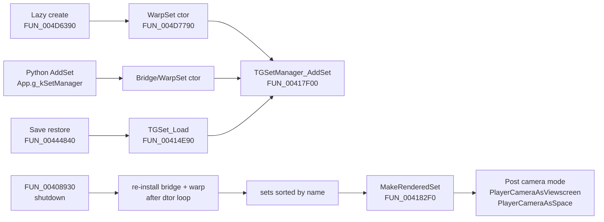

> [docs](../README.md) / [gameplay](README.md) / tgset-system.md

---
title: TGSet System (SetClass / BridgeSet / WarpSet)
type: reference
audience: re-engineer
validated: 2026-05-28
methodology: FUNCTION_DOC_WORKFLOW_V5
binary:
  name: stbc.exe
  size: 6394712
  base: 0x00400000
status: verified
evidence:
  - claim: "SetClass (base) class ID 0x80d1, vtable 0x00888a7c, size 0x13C"
    address: 0x0040D150
    function: SetClass_Ctor
    completeness: high
    confidence: high
    note: "Ctor at 0x0040D150 line `*param_1 = &PTR_FUN_00888a7c`; dtor FUN_0040DBD0 calls FUN_00717B20(0x13c) confirming size = 316 bytes; GetClassID slot at 0x0040D970 returns 0x80d1."
  - claim: "SetClass ctor at 0x0040D150, dtor at 0x0040DBD0"
    address: 0x0040D150
    function: SetClass_Ctor
    completeness: high
    confidence: high
  - claim: "BridgeSet class ID 0x80d2, vtable 0x00894830, size >= 0x144"
    address: 0x00665CC0
    function: BridgeSet_Ctor
    completeness: high
    confidence: high
    note: "Ctor sets vtable 0x00894830; writes 4 extra fields at +0x10C, +0x104, +0x13C, +0x140 — sizeof >= 0x144 (likely 0x148 aligned). GetTypeID slot at 0x00665D10 returns 0x80d2."
  - claim: "BridgeSet ctor at 0x00665CC0, dtor at 0x00665DD0"
    address: 0x00665CC0
    function: BridgeSet_Ctor
    completeness: high
    confidence: high
  - claim: "WarpSet (StarBackdrop) class ID 0x80d3, vtable 0x0088cdf8, size 0x148"
    address: 0x004D7A00
    function: WarpSet_Ctor
    completeness: high
    confidence: high
    note: "Allocation at FUN_004D6390 via FUN_00717B70(0x148) confirms sizeof = 328 bytes. Heavy init in FUN_004D7790 (full warp init) — sets star backdrop at +0xE8, name 'Star Backdrop' at 0x008e0e88, texture 'data/stars/stars.tga' at 0x008e0e78, distance 300.0f (0x43960000)."
  - claim: "WarpSet ctor (full path FUN_004D7790, alt FUN_004D7A00)"
    address: 0x004D7790
    function: WarpSet_FullInit
    completeness: high
    confidence: high
  - claim: "WarpSet dtor at 0x004D7A30"
    address: 0x004D7A30
    function: WarpSet_Dtor
    completeness: high
    confidence: high
  - claim: "TGSetManager singleton at 0x0097e9c4 — bare global struct, NOT a class"
    address: 0x0097E9C4
    function: (global)
    completeness: high
    confidence: high
    note: "Layout proven by disasm of FUN_005BAE00 caller at 0x0065C11F..0x0065C142 (5 contiguous MOVs into 0x0097e9c4..0x0097e9d4). No vtable; SWIG wrappers reach it directly."
  - claim: "TGSetManager layout: +0x00 currentSet, +0x04 sets[], +0x08 setCount, +0x0C setCapacity, +0x10 (preserved across teardown)"
    address: 0x0065C11F
    function: (memory layout proof)
    completeness: high
    confidence: high
    note: "Disasm 0x0065C11F..0x0065C142 writes 5 contiguous DWORDs. Teardown FUN_00408930 zeroes the first four but NOT +0x10 — proves +0x10 has a distinct lifetime."
  - claim: "TGSet vtable slot 0 (dtor) at 0x0040DBD0"
    address: 0x00888A7C
    function: TGSet_vtable
    completeness: high
    confidence: high
    note: "Slot 0 of vtable 0x00888A7C; frees 0x13C bytes via FUN_00717B20(0x13c)."
  - claim: "TGSet vtable slot 21 (+0x54) EnterSet at 0x0040EC90 — posts events 0x0080005c or 0x0080005d"
    address: 0x0040EC90
    function: TGSet_EnterSet
    completeness: high
    confidence: high
    note: "Posts event 0x0080005C if object IsA(0x8009)==Character, otherwise 0x0080005D. Event allocated as 0x28-byte TGEvent via FUN_00717B70(0x28)+FUN_00718010+FUN_006D5C00."
  - claim: "TGSet vtable slot 22 (+0x58) ExitSet at 0x0040F070 — posts events 0x0080005e or 0x0080005f"
    address: 0x0040F070
    function: TGSet_ExitSet
    completeness: high
    confidence: high
    note: "Posts event 0x0080005E if object IsA(0x8009)==Character, otherwise 0x0080005F. Uses 0x38-byte TGObjPtrEvent at vtable 0x008887AC for the character path."
  - claim: "TGSet vtable slot 27 (+0x6C) CompareName at 0x0040DA10"
    address: 0x0040DA10
    function: TGSet_CompareName
    completeness: high
    confidence: high
    note: "Calls strcmp(this+0x74, arg). Used by FindSetIndexByName (FUN_004055A0) binary search."
  - claim: "TGSet vtable slot 4 (+0x10) Save at 0x00414750"
    address: 0x00414750
    function: TGSet_Save
    completeness: high
    confidence: high
    note: "Debug string 'Saving set %s\\n'; argument 1 = *(param_1 + 0x74) confirming name field offset."
  - claim: "TGSet vtable slot 5 (+0x14) Load at 0x00414E90"
    address: 0x00414E90
    function: TGSet_Load
    completeness: high
    confidence: high
    note: "Debug string 'Loading set %s\\n'."
  - claim: "Set name at +0x74, ID at +0x1D"
    address: 0x00414750
    function: TGSet_Save
    completeness: high
    confidence: high
    note: "Save fn line 1 reads `*(param_1 + 0x74)` as 'Saving set %s' arg."
  - claim: "'bridge' string literal at 0x008d866c (len 6)"
    address: 0x008D866C
    function: (string const)
    completeness: high
    confidence: high
  - claim: "'warp' string literal at 0x008d8ab8 (len 4)"
    address: 0x008D8AB8
    function: (string const)
    completeness: high
    confidence: high
  - claim: "Object -> currentSet link at obj+0x20"
    address: 0x006A05E0
    function: EnterSet_Handler
    completeness: high
    confidence: high
    note: "Multi-source proof: EnterSet handler at 0x006A05E0 reads `*(int**)(ship+0x20)` as currentSet; Game_GetCurrentSet at FUN_004069C0 returns the equivalent on the play-window mission; FUN_00409170 reads DAT_0097e9c4+0x74 (current set name) for comparison."
  - claim: "MakeRenderedSet at FUN_004182F0"
    address: 0x004182F0
    function: TGSetManager_MakeRenderedSet
    completeness: high
    confidence: high
    note: "Linear scan; after match sets manager+0x04 = found set, then posts camera mode events ('PlayerCameraAsViewscreen' for 'bridge', 'PlayerCameraAsSpace' otherwise)."
  - claim: "Lazy WarpSet creator at FUN_004D6390 (GetOrCreateWarpSet)"
    address: 0x004D6390
    function: GetOrCreateWarpSet
    completeness: high
    confidence: high
    note: "If FindSetByName('warp') == NULL: alloc 0x148 via FUN_00717B70, ctor via FUN_004D7790, AddSet via FUN_00417F00 with &DAT_008d8ab8."
  - claim: "AddSet at FUN_00417F00"
    address: 0x00417F00
    function: TGSetManager_AddSet
    completeness: high
    confidence: high
    note: "Sorted insert by name; resizes capacity if full; if matching name already active, calls vtable+0x58 (ExitSet) on the existing entry first."
  - claim: "Standard set name catalog contains ONLY 'bridge' and 'warp'"
    address: null
    function: (string-table search)
    completeness: high
    confidence: high
    note: "Negative claim. String search of binary returned only 'bridge' (0x008d866c) and 'warp' (0x008d8ab8) as standard set names. The 'Multi1/Multi2' pattern referenced in some prior docs is from Multiplayer mission map names, NOT TGSet names. Mission scripts can register ad-hoc set names via App.g_kSetManager.AddSet (e.g. 'Engineering' in BridgeHandlers.py line 827) but these are per-mission, not stock."
companions:
  - docs/protocol/objnotfound-requestobj-enterset-wire-format.md
  - docs/gameplay/ship-navigation.md
  - docs/architecture/multiplayer-mission-infrastructure.md
  - docs/engine/netimmerse-vtables.md
  - docs/engine/rtti-class-catalog.md
  - docs/architecture/dedicated-server.md
  - docs/protocol/v5-validation-status.md
supersedes:
  - (no prior dedicated TGSet doc)
---

# TGSet System

> [!NOTE]
> **TGSet has a 3-class hierarchy** (SetClass `0x80d1`, BridgeSet `0x80d2`,
> WarpSet `0x80d3`) all inheriting through TGEventHandlerObject `0x102`. The
> TGSetManager is a bare global (not a class) at `0x0097E9C4`. Standard set
> name catalog: only **'bridge'** and **'warp'** in the binary. The 'Multi1
> / Multi2' pattern referenced in some prior docs is mission map names, NOT
> set names. Set membership is replicated only via opcode 0x1F EnterSet
> (per [protocol leaf #18](../protocol/objnotfound-requestobj-enterset-wire-format.md))
> and ObjCreate; it is **NOT** in StateUpdate dirty bits (silent drift
> possible across clients during normal play). Object -> set link at
> `obj+0x20`.

Reference for the TGSet class family — what a "set" is in BC's engine, who
owns it, how it mutates, and what crosses the wire when sets change.

## 1. Class Hierarchy

A 3-level inheritance chain of NiObject-derived classes that do **NOT** use
the NiRTTI factory at `DAT_0099A578`. They use the TGObject family's own
`GetClassID`/`IsA` pattern (vtable slots 1 and 2 are `GetClassID` and `IsA`).

| Class | Class ID | sizeof | vtable | Ctor | Dtor | Python name |
|-------|----------|--------|--------|------|------|-------------|
| **SetClass** (base) | **0x80d1** | **0x13C** | **0x00888A7C** | FUN_0040D150 | FUN_0040DBD0 | `SetClass` |
| **BridgeSet** | **0x80d2** | >= 0x144 (likely 0x148) | **0x00894830** | FUN_00665CC0 | FUN_00665DD0 | `BridgeSet` |
| **WarpSet** | **0x80d3** | **0x148** | **0x0088CDF8** | FUN_004D7A00 / FUN_004D7790 (full) | FUN_004D7A30 | `WarpSet` |

### IsA chains (vtable slot 2 = GetTypeID)

- **SetClass (0x80d1)** at `0x0040D980` returns: `0x80d1`, `0x102` (TGEventHandlerObject), `0x4`, `0x3`, `0x2` (TGObject deep base)
- **BridgeSet (0x80d2)** at `0x00665D10` returns: `0x80d2`, `0x80d1`, `0x102`, `0x4`, `0x3`, `0x2`
- **WarpSet (0x80d3)** follows the same pattern: `0x80d3`, `0x80d1`, `0x102`, `0x4`, `0x3`, `0x2` (inherits SetClass, NOT BridgeSet)

### Class metadata vtable slots (slot 9, 10, 11 — TGObject triad)

For SetClass:

| Slot | Address | Returns |
|------|---------|---------|
| 9 (+0x24) | 0x0040D9C0 | `"SetClass"` (s_SetClass_008d8b90) — GetTypeName |
| 10 (+0x28) | 0x0040D9D0 | `"_p_SetClass"` (s_p_SetClass_008d8b9c) — GetSWIGName |
| 11 (+0x2C) | 0x0040D9E0 | `"SetClassPtr"` (s_SetClassPtr_008d8ba8) — GetSWIGPtrName |

### Class category check

`FUN_00665E00(obj)` is `IsBridgeSet(obj)` — calls `obj->vtable[+0x08](0x80d2)` and returns obj if IsA succeeds. Used by `FUN_00408790` (current-mission-set retrieval) — so it filters for BridgeSet specifically, NOT base SetClass.

There's a stray TGFactory registry entry at `DAT_00901A90` with factory header byte `0x80d2`, but no callers — the binary uses runtime `IsA`, not the registry, for TGSet identity.

## 2. TGSetManager

The manager is a **bare global struct** at `0x0097E9C4` (no class, no vtable).
SWIG wrappers reach it directly.

```c
struct TGSetManager {
  /*+0x00*/ TGSet*  currentSet;       // DAT_0097e9c4 — active/rendered set
  /*+0x04*/ TGSet** sets;             // DAT_0097e9c8 — sorted array of TGSet*
  /*+0x08*/ int     setCount;         // DAT_0097e9cc
  /*+0x0C*/ int     setCapacity;      // DAT_0097e9d0
  /*+0x10*/ ??      field_10;         // DAT_0097e9d4 — preserved across teardown
};
```

**Layout proof**: Disasm at `0x0065C100`..`0x0065C149` (a "copy from other manager" routine, FUN_005BAE00 caller):

```
0065C11F  MOV [0x0097E9C4], ECX   ; from input[1]
0065C127  MOV [0x0097E9C8], ECX   ; from input[2]
0065C130  MOV [0x0097E9CC], ECX   ; from input[3]
0065C139  MOV [0x0097E9D0], EDX   ; from input[4]
0065C142  MOV [0x0097E9D4], EAX   ; from input[5]
```

The teardown at `FUN_00408930` zeros `currentSet`, `sets`, `setCount`, `setCapacity` but **NOT** `field_10` — proves the field has a distinct lifetime. Likely a "default fallback set" or an Episode reference; not load-bearing for protocol.

### Manager operations

| Operation | Function | Notes |
|-----------|----------|-------|
| `FindSetIndexByName(name)` | FUN_004055A0 | **Binary search** over `sets[]` using vtable+0x6C (CompareName). Returns -1 if not found. Already named in the Ghidra DB pre-pass. |
| `FindSetByName(name)` | inlined | `set = sets[FindSetIndexByName(name)]`; sometimes wrapped in helpers (e.g. `FUN_004D6390` does this then lazy-creates). |
| `AddSet(set, name)` | FUN_00417F00 | Sorted insert; resizes capacity if full; if same-name set already exists, calls slot+0x58 (ExitSet) on it first. Rebroadcasts via FUN_0070E260(1). |
| `RemoveSet(name)` | FUN_004180E0 | Binary search by name, remove from array, dec count. |
| `DeleteSet(name)` | FUN_004182F0 | Like RemoveSet but also **looks up + frees** the set object, then triggers camera mode change. |
| `MakeRenderedSet(name)` | FUN_004182F0 (paired) | Linear scan; sets `manager+0x04 = found set`. Posts camera mode events: `"PlayerCameraAsViewscreen"` for `bridge`, `"PlayerCameraAsSpace"` otherwise. |
| `DeleteAllSets` | (in FUN_00408930) | Iterates sets[] calling vtable[0](1) (scalar dtor); zeroes the first 4 DWORDs of the manager. |
| `GetNumSets` | direct DWORD read of DAT_0097e9cc | inline |
| `GetAllSets` (Python binding) | FUN_004188B0 | Iterates DAT_0097e9c8 / 0x0c, returns a SWIG tuple. |

### Python API (App.py, lines 3500-3636)

```python
class SetManager:
    def GetSet(name): ...        # find by name
    def AddSet(set, name): ...   # adds and assigns name
    def RemoveSet(set): ...      # remove without deleting
    def DeleteSet(name): ...     # remove + free
    def DeleteAllSets(): ...     # nuke
    def GetNumSets(): ...        # count
    def ClearRenderedSet(): ...
    def MakeRenderedSet(name): ...
    def GetRenderedSet(): ...
    def Terminate(): ...

g_kSetManager = SetManagerPtr(Appc.globals.g_kSetManager)
```

No per-instance state — the SWIG ptr is a wrapper around the singleton block.

## 3. TGSet vtable (0x00888A7C)

32+ slots; the table extends past slot 31 (inherited TGEventHandlerObject infra
continues). These are the slots load-bearing for set lifecycle and protocol.

| Slot | Byte off | Address | Method | Notes |
|------|----------|---------|--------|-------|
| 0 | +0x00 | 0x0040DBD0 | **~TGSet** | scalar dtor; frees 0x13C bytes |
| 1 | +0x04 | 0x0040D970 | **GetClassID** | returns `0x80d1` |
| 2 | +0x08 | 0x0040D980 | **IsA** | 0x80d1, 0x102, 4, 3, 2 |
| 3 | +0x0C | 0x006F1650 | (inherited TGObject) | |
| **4** | **+0x10** | **0x00414750** | **Save / WriteToStream** | "Saving set %s\n" |
| **5** | **+0x14** | **0x00414E90** | **Load / ReadFromStream** | "Loading set %s\n" |
| 6 | +0x18 | 0x00415B70 | (likely Update) | not decoded |
| 7 | +0x1C | 0x00415BA0 | (likely Render) | not decoded |
| 8 | +0x20 | 0x006F15C0 | (inherited TGEventHandlerObject) | |
| 9 | +0x24 | 0x0040D9C0 | **GetTypeName** | returns "SetClass" |
| 10 | +0x28 | 0x0040D9D0 | **GetSWIGName** | returns "_p_SetClass" |
| 11 | +0x2C | 0x0040D9E0 | **GetSWIGPtrName** | returns "SetClassPtr" |
| 12-18 | +0x30-+0x48 | various | (TG event dispatch) | inherited |
| 19 | +0x4C | 0x0040D9F0 | (returns DAT_0097E7C0) | possibly GetEventTable |
| 20 | +0x50 | 0x006D9240 | (inherited base) | |
| **21** | **+0x54** | **0x0040EC90** | **EnterSet** | adds object; posts 0x0080005C (Character) or 0x0080005D (Object) |
| **22** | **+0x58** | **0x0040F070** | **ExitSet** | removes object; posts 0x0080005E (Character) or 0x0080005F (Object) |
| 23 | +0x5C | 0x0040F8C0 | (DestroyObject from set?) | not decoded |
| 24 | +0x60 | 0x0040FFB0 | | not decoded |
| 25 | +0x64 | 0x004107D0 | | not decoded |
| 26 | +0x68 | 0x00410730 | | not decoded |
| **27** | **+0x6C** | **0x0040DA10** | **CompareName** | strcmp(this+0x74, arg) — used by FindSetIndexByName |
| 28 | +0x70 | 0x0040DA00 | **InsertCompare** | calls inner vtable+0x6C — used by AddSet binary insert |
| 29 | +0x74 | 0x00415AD0 | | not decoded |
| 30 | +0x78 | 0x00415CD0 | | not decoded |
| 31 | +0x7C | 0x00417970 | | not decoded |

## 4. SetClass Base Layout (size 0x13C)

Reconstructed from the ctor, dtor, Save, Load, EnterSet, ExitSet, and Update.

| Offset | Field | Type | Purpose |
|--------|-------|------|---------|
| +0x00 | vtable | ptr | 0x00888A7C (SetClass) / 0x00894830 (BridgeSet) / 0x0088CDF8 (WarpSet) |
| +0x04 | refCount? | u32 | (TGObject base) |
| +0x08-+0x0B | TGObject base | bytes | inherited |
| +0x0C-+0x47 | TGEventHandlerObject base | bytes | event handler infra (NameToHandlerMap area at +0x20) |
| +0x2C | useNewObjectListFlag | byte | switches +0x30 vs +0x3C as insertion list |
| +0x30 | objects[] (main) | ptr | array of object refs (sorted by ID via FUN_00431030) |
| +0x34 | objectCount | int | |
| +0x38 | objectCapacity | int | |
| +0x3C | newObjects[] | ptr | "new this frame" objects (used in transition path) |
| +0x40 | newObjectCount | int | |
| +0x44 | newObjectCapacity | int | |
| +0x48 | cameras[] | ptr | |
| +0x4C | cameraCount | int | |
| +0x54 | lights[] | ptr | |
| +0x58 | lightCount | int | |
| +0x68 | (4-element float block) | floats | unused/placeholder |
| **+0x74** | **name** | **char\*** | **set name** ("bridge", "warp") — heap-allocated, set via FUN_0040DF80 (TGSet::SetName) |
| +0x78-+0x8C | misc state | various | flags/bounds |
| +0x88 | flag | byte | init=1 |
| +0x8A | flag | byte | init=1 |
| +0x8C | bound | f32 | init=0x3FFFFFFF (~2.0f) |
| +0x90-+0xAB | camera transforms | floats | |
| +0xA8 | backdropContainer | ptr (TGSet*) | sub-container; +0xD4/+0xD8 = capacity/count |
| +0xB0 | savedFlag wrapper | ptr | save/load gate |
| +0xDC-+0xE7 | vec3 fields | f32 | |
| +0xE8 | sound? | ptr | |
| +0xEC | proximityListenerSet | ptr | neighboring set for proximity events |
| +0xF0 | enableProximity | byte | |
| +0xF4 | viewBackdropController | ptr | non-null -> manages backdrops |
| +0x100 | backgroundModel | ptr (string) | "BackgroundModel" name |
| +0x10D | isInteresting | byte | "currently relevant to player" (FUN_00416230) |
| +0x110 | backdropPairCount | int | up to 4 (objID, viewBackdrop) pairs |
| +0x114 + i\*8 | backdropPair[i].objID | int | LRU-evicted max 4 |
| +0x118 + i\*8 | backdropPair[i].viewBackdrop | ptr | |
| +0x13C | (end of base) | | BridgeSet/WarpSet extend past here |

### BridgeSet extra fields (vtable 0x00894830)

Ctor `FUN_00665CC0` writes:

```c
*(undefined1 *)(this + 0x10C) = 0;   // byte flag (overlays base +0x10C)
this[0x41] = 0;                       // = +0x104, overwrites base flag
this[0x4F] = 0;                       // = +0x13C, first extra field
this[0x50] = 0;                       // = +0x140, second extra field
```

Extends sizeof to at least 0x144 (likely 0x148 to stay aligned).

### WarpSet extra fields (vtable 0x0088CDF8)

Ctor `FUN_004D7A00` plus heavy-init `FUN_004D7790`:

```c
this[0x3A] = piVar2;     // = +0xE8, star backdrop sub-object (NiBackdrop, 0xAC bytes via FUN_0058E400)
this[0x4F] = 0;          // = +0x13C
this[0x50] = 0;          // = +0x140
*(uchar*)(this + 0x51) = 0;  // = +0x144
```

Star backdrop config hard-coded by WarpSet ctor:

- Sub-object name `"Star Backdrop"` at `0x008E0E88`
- Texture path `"data/stars/stars.tga"` at `0x008E0E78` (via subobj vtable+0x118)
- Scale 0x100, alpha 1.0, distance 0x43960000 (= 300.0f)

Allocation at `FUN_004D6390` via `FUN_00717B70(0x148)` + `FUN_00718010("UNKNOWN", 0)`, then `FUN_004D7790`. **Confirmed sizeof = 0x148.**

## 5. Set Lifecycle

### Creation paths (4)

**1. C++ allocation (lazy warp set create)** — `FUN_004D6390` GetOrCreateWarpSet:

```c
if (FindSetByName("warp") == NULL) {
  set = FUN_00717B70(0x148);              // alloc WarpSet sizeof
  FUN_00718010("UNKNOWN", 0);             // commit alloc tag
  set = FUN_004D7790(set, 0);             // WarpSet ctor (calls SetClass ctor first)
  FUN_00417F00(set, &DAT_008D8AB8);       // AddSet(set, "warp")
}
```

**2. Python allocation** — Mission scripts call `App.g_kSetManager.AddSet(pSet, "name")` after constructing via `App.BridgeSet()` or `App.WarpSet()` SWIG ctors.

**3. Save-file restoration** — `FUN_00444840` (TopLevel load) reads each set from a save stream and calls `TGSet::Load` (vtable+0x14 = `FUN_00414E90`), which deserializes objects, cameras, lights into the set fields.

**4. Teardown preservation** — `FUN_00408930` (cleanup all sets) iterates `DAT_0097E9C8` from the back, calling `vtable[0](1)` (scalar destructor) on each. After all are freed, it **re-installs the saved "bridge" and "warp" sets** (if they were captured before teardown) — so those two persist across mission boundaries.

### EnterSet (vtable+0x54 / FUN_0040EC90)

```
Input:  this (TGSet*), object (TGObject*), [optional placement]
Steps:
  1. If object already in name->object map at +0x80/+0x8C: return 0 (already-in-set).
  2. Call object->vtable[+0x68](this) — registers set ptr on object side.
  3. Insert object into hash map (+0x80 = compare fn, +0x8C = hash buckets) + name list.
  4. If this+0x2C == 0 (use main object list):
       Insert object pointer into sorted array (+0x30..+0x38) sorted by object[1] (objectID via FUN_00431030).
     else:
       Insert into "new objects" deferred list (+0x3C..+0x44).
  5. Update spatial hash via FUN_0040B220 (calls object->vtable[+0xB8](this)).
  6. Set this+0xF0 = 1 (proximity-enable flag).
  7. Post event:
       if object->IsA(0x8009) == true (Character): event ID 0x0080005C
       else: event ID 0x0080005D (object enter)
     Allocated as 0x28-byte TGEvent via FUN_00717B70(0x28)+FUN_00718010+FUN_006D5C00.
     Target = object; posted via TGEventManager.
```

### ExitSet (vtable+0x58 / FUN_0040F070)

```
Input:  this (TGSet*), objectID
Steps:
  1. obj = TGSceneGraph__GetObjectByID(0, objectID).
  2. If obj->IsA(0x8009) == true (Character): post 0x0080005E via 0x38-byte TGObjPtrEvent (vtable 0x008887AC).
     else: post 0x0080005F (object exit).
  3. Remove obj from this+0x20 (object->name map) and this+0x80 hash.
  4. Find obj in cameras[] (+0x48) — if matched, release via vtable+0xA0.
     Find obj in lights[] (+0x54) — if matched, release.
  5. Call obj->vtable[+0x60](0) — clears obj's setRef (writes obj+0x20 = 0).
  6. Set this+0xF0 = 1.
  7. If this+0xF4 != 0: FUN_005A7640(obj) — drops obj from viewBackdrop tracking.
  8. Call this+0x16 array of "set listeners" — invokes vtable+0xD0 on each, passing obj.
```

### Object -> Set linkage on the OBJECT side

When an object joins a set:

- `obj->vtable[+0x60](set)` writes `*(int*)(obj+0x20) = set`. ExitSet clears it via the same slot with arg `0`. (Slot +0x60 = **SetContainingSet**.)
- Slot +0x68 is different — sets the object's name.

So `obj+0x20` is the canonical "containing set" pointer. Multi-source confirmed:

- EnterSet handler at `0x006A05E0` reads `*(int**)(ship+0x20)` as currentSet.
- `Game_GetCurrentSet` at `FUN_004069C0` returns `mission+0x20`.
- Mission player exited handler at `FUN_00409170` reads `DAT_0097E9C4+0x74` (current set name) — confirms manager+0x00 = active set ptr.

### Destruction

Dtor `FUN_0040DBD0` calls `FUN_00717B20(0x13C)` + `FUN_00718180` — TGFree(this, 0x13C) confirming base TGSet size = 316 bytes. WarpSet/BridgeSet dtors call ~SetClass first then their own slot[0] frees their extended size.



## 6. Standard Set Name Catalog

Byte-confirmed via string search of the binary.

| Name | String addr | Subclass | Notes |
|------|-------------|----------|-------|
| `"bridge"` | `0x008D866C` (len 6) | **BridgeSet (0x80d2)** | Captain's bridge scene. Named characters: Helm, Tactical, XO, Science, Engineer, Picard, Data, Saalek, Korbus. Persisted across mission teardowns. Triggers `PlayerCameraAsViewscreen` on activation. |
| `"warp"` | `0x008D8AB8` (len 4) | **WarpSet (0x80d3)** | The in-space scene. Carries the StarBackdrop (loads `data/stars/stars.tga`). Persisted across teardowns. Triggers `PlayerCameraAsSpace`. |
| `"space"` | (BridgeHandlers.py only) | (alias usage) | Python uses "space" in some places interchangeably with "warp" — local synonym, NOT a binary-side literal. Likely a per-mission rename via SetName. |
| `"Engineering"` | (BridgeHandlers.py line 827) | **BridgeSet** | Per-mission engineering sub-scene. Created at mission init via `App.g_kSetManager.AddSet`. |
| `"Star Backdrop"` | `0x008E0E88` | — | NOT a SetManager entry; it's the **object name** inside WarpSet's backdrop sub-object. |
| Mission-specific | mission .py files | SetClass base | Created at mission init via Python's `App.g_kSetManager.AddSet`. AsteroidField sets register listeners for 0x0080005d / 0x0080005f / 0x00800062. |

**No "Multi1" / "Multi2"**: String search of the binary found no `"Multi1"` / `"Multi2"` set name literals. The "Multi*" naming is from Multiplayer map names in `Multiplayer/MultiplayerMenus.py` mission selection — NOT TGSet names. Set names in MP are just `"bridge"` (when on the ship) and `"warp"` (when in space), with mission scripts naming any ad-hoc sub-sets at will.

The EnterSet wire packet (opcode 0x1F) carries an arbitrary set name as a uint32-prefixed string — any mission script can name its sets anything. The hard-coded common names are just `"bridge"` and `"warp"`.

## 7. Object -> Set Mapping (obj+0x20)

`obj+0x20` is the "currentSet" pointer on every object derived from a TGObject-with-Set-awareness base (Ship, Character, Camera, Backdrop, etc.).

Validation:

- **EnterSet handler (opcode 0x1F receiver)** at `FUN_006A05E0` reads `*(int**)(ship+0x20)` as currentSet.
- **Game_GetCurrentSet** at `FUN_004069C0` returns `mission+0x20` (the play window's mission has its own currentSet ptr — actually that's `*(playWindow+0x54)+0x20`; mission and ship share the offset by convention).
- **Mission player-exited handler** at `FUN_00409170` reads `DAT_0097E9C4+0x74` (current set name from manager+0x00 -> name field).

Slot-+0x60 writes obj+0x20 (called by EnterSet via the same dispatch; called by ExitSet with arg 0 to clear).

## 8. Multiplayer State

### Direct: opcode 0x1F EnterSet

The host sends opcode 0x1F when a player ship's currentSet changes from a NAMED set to another NAMED set (e.g. exiting "warp" tunnel into a system, or going to "bridge" for a cutscene). The client receives, looks up the destination set in its own TGSetManager (which must already have the same name registered), and applies vtable+0x54 (EnterSet).

Wire format: `[u32 objectID][u32 nameLen][bytes name]`. **The packet does NOT replicate the set definition** — both sides must already have the set with the same name. If the client doesn't have a matching set name, it sends back opcode 0x1E (ObjNotFound).

See [protocol leaf #18 — objnotfound/requestobj/enterset](../protocol/objnotfound-requestobj-enterset-wire-format.md) for the full wire format and handler logic.

EnterSet handler validation gates (host-side, FUN_006A05E0):

1. Object must exist via TGSceneGraph__GetObjectByID — otherwise reply with 0x1E (ObjNotFound).
2. Object must `IsA(0x8008)` — Ship — otherwise silently drop (no error reply).
3. Ship must have a warp engine subsystem (`ship+0x2D0 != 0`).
4. Warp engine must not already be in transit (`*(ship+0x2D0)+0xB4 == 0`).
5. Set name must resolve in local SetManager (otherwise silent drop).

Useful constraint for headless: non-ship objects (subsystems, weapons) cannot have phantom set transitions injected — the IsA(0x8008) gate filters them out.

### Indirect: object+0x20 in StateUpdate?

**No.** `obj+0x20` (currentSet ptr) is NOT serialized in StateUpdate (opcode 0x1C). StateUpdate transmits dirty-flagged fields per ship at +0x100+; none of the documented dirty bits target +0x20.

Set membership is communicated ONLY via:

1. **Explicit opcode 0x1F EnterSet** events (warp transitions)
2. **Implicit ObjCreate** (opcode 0x02/0x03): the new object goes into the default/active set on each side — clients add the object to *their* currentSet; host adds to its active set
3. **Set transition events fire as PythonEvent (opcode 0x06)** — `Mission::PlayerEnteredSet` / `PlayerExitedSet` — if the Python handler decides to send anything wire-side, that goes through normal PythonEvent transport

### Silent drift risk

**Set membership is NOT continuously verified across the wire.** If the host moves a ship to a different set without sending 0x1F, the client's copy stays in the wrong set forever (until the next ObjCreate or re-checksum). In practice, ships rarely change sets mid-mission outside of warp transitions, so this is invisible — but worth knowing for OpenBC clean-room work.

### Per-set roster

Each TGSet maintains a per-set roster — the `+0x30 / +0x34 / +0x38` sorted object array. This is local-side only. Host's roster and a client's roster can drift; they're reconciled at object creation (each ObjCreate places the object in the current set on the receiver's side) and at set transitions (0x1F).

## 9. Camera / Rendering Side Notes

Out of scope for headless servers, but useful context:

- `MakeRenderedSet(name)` in C++ = `FUN_004182F0` finds the set, assigns `manager+0x04 = set`, then posts camera mode events.
- The rendered set drives the renderer's scene root via the `viewBackdropController` at `+0xF4`. It's iterated in `FUN_00413CB0` — every game-loop frame the renderer queries this set for up-to-4 nearest viewable objects (LRU-evicted; max 4 backdrop pairs at `+0x114/+0x118`).
- For a headless server: setting `currentSet = NULL` breaks a lot of code. Bootstrap should ensure the "warp" set exists — the lazy-create logic in `FUN_004D6390` handles this when first looked up.

## 10. OpenBC Implications

- **Set membership doesn't need a dirty bit.** Opcode 0x1F (EnterSet) and ObjCreate (0x02/0x03) carry everything needed for replication; no per-tick state update has to mention set membership.
- **Both sides must agree on the set name catalog.** Wire format only carries the set name; both ends must already have registered a set under that name. Stock pre-registers "bridge" and "warp" via lazy create / save restore; mission scripts add the rest at mission init.
- **Validation gates are useful precedent.** The handler at `0x006A05E0` rejects: non-existent objects (replies 0x1E), non-Ship objects (silent drop), ships without warp engines, warp engines already in transit, and unknown set names. A clean-room implementation should preserve these to avoid client desync paths.
- **"Bridge" and "warp" persist across teardown.** The shutdown path at `FUN_00408930` re-installs them after the dtor loop. OpenBC bootstrap should ensure both exist at session start.
- **Cut savegame code references this system.** `DEAD_Ship_SaveCheckpoint` at `0x005B0FA0` (see [targeting-system.md](targeting-system.md)) was a partner to TGSet_Save/Load; the savegame path was cut from the shipping build but the TGSet half remains hooked.

## Open Questions

1. **Vtable slot +0x60 writer**: claimed (and multi-source confirmed via EnterSet/ExitSet) to write `obj+0x20`. The actual writer function inside the slot was not decompiled this pass. Confidence HIGH on what the slot does; the body itself is one indirection away.
2. **`field_10` semantics (DAT_0097E9D4)**: saved across teardowns. Possibly "default fallback set" or an Episode reference. Not load-bearing.
3. **TGFactory entry at `DAT_00901A90`**: a stray entry with factory header byte `0x80d2` exists in the registry. No callers — binary uses runtime IsA, not the registry. **Likely dead.**
4. **Vtable slots 6, 7, 23-26, 29-31**: addresses known, semantics not decoded this pass. Likely Update / Render / camera-add / light-add / object-destroy variants. Out of scope for protocol; useful for engine-side completeness later.

## Ghidra Annotations Applied [v5 2026-05-28]

### Suggested renames (not yet applied)

Per v5 policy, the documentation-writer pass does not apply renames. Per the archaeology memo:

| Address | Suggested name |
|---------|----------------|
| FUN_0040D150 | TGSet__Ctor |
| FUN_0040DBD0 | TGSet__ScalarDtor |
| FUN_0040DC00 | TGSet__Dtor |
| FUN_0040DF80 | TGSet__SetName |
| FUN_0040EC90 | TGSet__EnterSet |
| FUN_0040F070 | TGSet__ExitSet |
| FUN_0040DA10 | TGSet__CompareName |
| FUN_00414750 | TGSet__Save |
| FUN_00414E90 | TGSet__Load |
| FUN_00413CB0 | TGSet__UpdateBackdrops |
| FUN_00408C00 | TGSet__ProcessRemovedObjects |
| FUN_004055A0 | TGSetManager__FindSetIndexByName (already named) |
| FUN_00417F00 | TGSetManager__InsertObjectInSet |
| FUN_004182F0 | TGSetManager__MakeRenderedSet |
| FUN_00408930 | TGSetManager__Shutdown |
| FUN_004188B0 | TGSetManager_GetAllSets (SWIG) |
| FUN_00665CC0 | BridgeSet__Ctor |
| FUN_00665DD0 | BridgeSet__Dtor |
| FUN_004D7A00 | WarpSet__Ctor |
| FUN_004D7790 | WarpSet__FullInit |
| FUN_004D6390 | GetOrCreateWarpSet |
| FUN_00665E00 | IsBridgeSet |
