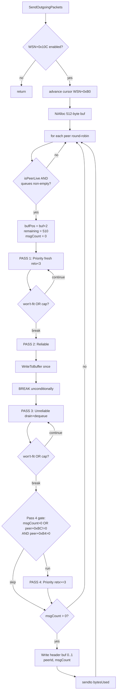

> [docs](../README.md) / [networking](README.md) / packet-bundling.md

# Packet Bundling — TGWinsockNetwork SendOutgoingPackets

> [!NOTE]
> **Stock STBC's `SendOutgoingPackets` uses a 4-pass drain algorithm** packing up to 255 TGMessages per UDP datagram (512-byte MTU). The reliable queue is **ONE-SHOT per datagram** (Pass 2 unconditional break after first attempt). The Pass-4 retransmit gate is what creates the ACK-outbox deadlock documented in [ack-outbox-deadlock.md](ack-outbox-deadlock.md). OpenBC currently sends 1 message per datagram (no bundling); this doc is the spec for what OpenBC needs to match for wire parity. See [v5-evidence-header.md](../guides/v5-evidence-header.md) for the standard. Source evidence: `.claude/agent-memory/game-archaeology-specialist/packet-bundling-validation-20260528.md`.

Reverse-engineered from stbc.exe via Ghidra decompilation. All function addresses, struct offsets, and constants byte-confirmed at the cited disassembly. No new functions created this pass; relies on pre-existing v5 anchors from [ack-outbox-deadlock.md](ack-outbox-deadlock.md).

**Related docs**:
- [ack-outbox-deadlock.md](ack-outbox-deadlock.md) — Pass 4 gate produces the deadlock; same `SendOutgoingPackets` body from a different angle
- [netimmerse-transport-deep-dive.md](netimmerse-transport-deep-dive.md) — engine-layer transport that wraps this bundler
- [multiplayer-flow.md](multiplayer-flow.md) — when in the join sequence the bundler starts firing
- [transport-layer.md](../protocol/transport-layer.md) — protocol-side view of the framing

---

## 1. Datagram Layout [v5-validated 2026-05-28]

### Wire structure

```
+--------+----------+-------------------------------------+
| byte 0 | byte 1   | bytes 2..N                           |
+--------+----------+-------------------------------------+
| peerId | msgCount | [TGMsg1][TGMsg2]...[TGMsgN]          |
+--------+----------+-------------------------------------+
  plaintext         ciphered (AlbyRules in-place from byte 1)
```

- **byte 0** (`buf[0]`): sender peer ID — read from `WSN+0x18` at write time (0x006B5B0E). Stays **plaintext** so receivers can look up the sender's cipher state before decrypting.
- **byte 1** (`buf[1]`): message count, max 255 — read from `iStack_28` at write time (0x006B5B0B).
- **bytes 2..N**: packed sequence of `TGMessage` blobs. Each blob is self-delimiting (length encoded in the inner type-specific format).

Header is written **AFTER** bundling completes, gated on `iStack_28 > 0` at 0x006B5AFA. If no messages packed, the buffer is freed and `sendto` is not called.

### MTU and usable payload

| Item | Value | Evidence |
|------|-------|----------|
| Inner base-class buffer field | `0x400` (1024) | `TGWinsockNetwork__BaseCtor` @ 0x006b3a00 line ~79: `param_1[0x2b] = 0x400` |
| **Subclass override (the actual MTU)** | **`0x200` (512)** | `TGWinsockNetwork__Ctor` @ 0x006b9bf0 (instr at 0x006B9C13: `MOV [param_1+0xAC], 0x200`) |
| Field offset | `WSN+0xAC` | DWORD #0x2B; read at 0x006B566C and 0x006B5BC5 |
| Allocator | `NiAlloc(512)` | `FUN_00718CB0(0x200)` at 0x006B55F2-0x006B55FF |
| Deallocator | `NiFree(buf)` | `FUN_00718CF0(puVar7)` at 0x006B5C26 |
| 2-byte header reserved | 2 | `LEA EAX,[buf+2]` + `SUB EBX,2` at 0x006B5672 / 0x006B5675 |
| **Usable per-datagram payload** | **510 bytes** | 512 − 2 header |

The subclass ctor is what actually runs at construction — the inner ctor's 1024 is dead. **OpenBC MUST use 512-byte buffers with 2-byte headers** for wire compatibility.

### Cipher boundary

`TGWinsockNetwork__SendPacket` (0x006b9870) invokes AlbyRules on `(buf+1, len-1)` — byte 0 (peer ID) stays plaintext. See `alby-rules-cipher-analysis.md` for cipher details. Cipher is in-place; no wire bytes added.

### sendto length is exact, not padded

```asm
006B5BC5: MOV EDX,[ECX+0xAC]    ; EDX = 512 (buffer capacity)
006B5BCD: SUB EDX,EBP            ; EDX = 512 - remaining = bytes used
006B5BCF: PUSH EDX                ; arg: actual datagram length
006B5BDA: CALL [EAX+0x70]         ; vtable[+0x70] = SendPacket
```

A datagram with one tiny message goes out at ~5-20 bytes; a fully-stuffed one at ~512 bytes. **OpenBC must NOT pad to MTU** — receivers parse exactly the bytes received.

### Bandwidth-overhead constant (stats only, not on wire)

`vtable[+0x58]` of TGWinsockNetwork at 0x006BAC50 returns `0x22` = 34 bytes — added to `peer+0x54` (totalWireBytes counter) per datagram to model IP(20) + UDP(8) + Ethernet(~6) overhead. **Stats only.** Not on the wire.

---

## 2. Per-Message Overhead [v5-validated 2026-05-28]

The bundled stream is a sequence of self-delimiting TGMessage blobs, each starting with a type byte. **There is NO outer length prefix** between messages on the wire — receivers parse the inner type-specific format to recover boundaries.

### TGMessage::WriteToBuffer contract (vtable slot 2)

Reference impl: `TGBufferStream__Serialize` @ 0x006b8340 — the type 0x32 general payload class. Inputs: `(pOutBuf, nBufSize)`. Returns `int bytesWritten`, or `0` if `nBufSize < requiredSize`.

### Type 0x32 (general payload) layout

```
[byte]  class-tag = 0x32                ; written by *pOutBuf
[short] flags|length                    ; (len & 0x1FFF) | (frag<<15) | (ord<<14) | (rel<<13)
[short] sequenceID                      ; IF (msg+0x3a != 0)
[byte]  fragmentIndex (msg+0x39)        ; IF (msg+0x3c != 0)
[byte]  fragmentTotal (msg+0x38)        ; IF (msg+0x3c != 0 AND msg+0x39 == 0)
[bytes] payload                         ; msg+0x04 buffer, msg+0x08 bytes
```

### Per-message overhead breakdown

| Component | Size | When present |
|-----------|------|--------------|
| Type byte | 1 | Always |
| Flags/length short | 2 | Always |
| Sequence ID | 2 | If reliable or fragmented (msg+0x3a != 0) |
| Fragment index | 1 | If fragment (msg+0x3c != 0) |
| Fragment total | 1 | If fragment AND first chunk (msg+0x39 == 0) |
| Payload | variable | msg+0x08 bytes |

**Minimum overhead**: 3 bytes (type 0x32 with no flags). Reliable adds 2. First-fragment adds 1-2.

### TGHeaderMessage (type 0x01, ACK envelope)

A different vtable[+0x08] implementation — emits 4-5 bytes typically. See `ack-outbox-deadlock.md` § 1 for the ACK-specific wire layout.

### What is NOT in the per-message overhead

- **No length prefix** between messages — receivers parse `[buf[1] | (buf[2]<<8)] & 0x1FFF` for type 0x32 length, then advance.
- **No separator byte** — boundaries are implicit in the self-delimiting format.
- **No checksum** — bundling trusts cipher integrity (mismatched key produces garbage that fails inner-message parse).

---

## 3. The 4-Pass Drain Algorithm [v5-validated 2026-05-28]

`SendOutgoingPackets` processes peers in round-robin starting at the cursor `WSN+0xB0` (advances by 1 per call). Each peer that passes the `vtable[+0x68]` liveness gate (always returns 1) gets a fresh 512-byte buffer, four passes, and one `sendto` if any messages were packed.

### Pass summary

| Pass | Queue head | Cursor | Count | Retx gate | Per-msg break | Range |
|------|------------|--------|-------|-----------|----------------|-------|
| **P1 Priority** (fresh) | peer+0x9C | peer+0xA8 / +0xAC | peer+0xB4 | `retx < 3` | won't-fit OR 255-cap | 0x006B5696-0x006B5740 |
| **P2 Reliable** (one-shot) | peer+0x80 | peer+0x8C / +0x90 | peer+0x98 | none | **unconditional after first attempt** | 0x006B5744-0x006B5825 |
| **P3 Unreliable** (drain + dequeue + promote) | peer+0x64 | peer+0x70 / +0x74 | peer+0x7C | none | won't-fit OR 254-cap | 0x006B5829-0x006B5A01 |
| **P4 Priority retx** (stale) | peer+0x9C | peer+0xA8 / +0xAC | peer+0xB4 | `retx >= 3`, free at `retx >= 9` | won't-fit OR 254-cap | 0x006B5A25-0x006B5AF4 |

### P1 — Priority fresh (retx < 3)

```c
while (msg != NULL) {
    if (!stale && msg->retxCount < 3) {
        bytesWritten = msg->vtable[+0x08](buf, remaining);   // WriteToBuffer
        if (bytesWritten == 0) break;                         // WON'T-FIT EXIT
        msg->lastSentTime = currentTime;
        msgCount++;
        msg->retxCount++;                                     // via FUN_006b8670 (also recomputes msg+0x1C interval)
        buf += bytesWritten;
        remaining -= bytesWritten;
        if (msgCount > 254) break;                            // CAP EXIT
    }
    advance to next message in priority queue;
}
```

**Multiple messages per datagram.** Capped at 255. Gate at 0x006B56CC: `CMP [EDI+0x18],0x3; JGE` skips messages with retx >= 3 (they're claimed by Pass 4 instead).

### P2 — Reliable (one-shot)

```c
while (msg != NULL) {
    if (!stale) {
        bytesWritten = msg->vtable[+0x08](buf, remaining);
        if (bytesWritten != 0) {
            msgCount++;
            msg->lastSentTime = currentTime;
            msg->retxCount++;
            buf += bytesWritten;
            remaining -= bytesWritten;
        }
        break;                                                // <<< ALWAYS BREAK at 0x006B57E5
    }
    // stale-cleanup path...
}
```

**At most ONE reliable message per datagram.** The `break` at 0x006B57E5 is unconditional — regardless of whether the message fit. If the buffer is full from Pass 1 and the next reliable returns 0, Pass 2 still breaks; reliable retry waits for next tick.

This is the design constraint that makes ACK throughput tractable (one ACK per RTT-tick window) and is the foundation of the [ack-outbox-deadlock.md](ack-outbox-deadlock.md) analysis.

### P3 — Unreliable (drain + dequeue + promote)

```c
bool firstSkip = true;
while (msg != NULL) {
    if (msg+0x3d == 0 && firstSkip) {
        firstSkip = false;                                    // skip first unreliable with flag 0
    } else {
        bytesWritten = msg->vtable[+0x08](buf, remaining);
        if (bytesWritten == 0) break;                         // WON'T-FIT EXIT
        msgCount++;
        // Dequeue and free from peer+0x64 list
        detach(msg);
        NiFree(node);
        peer+0x7C--;                                          // unreliable count
        if (msg+0x3a != 0) {
            // Promotion: re-queue as reliable if needs retry
            if (peer+0xB4 > 0.0f) {
                // alloc new node, push to peer+0x80/0x84, peer+0x98++
            } else {
                msg->Release(1);
            }
        } else {
            msg->Release(1);
        }
        buf += bytesWritten;
        remaining -= bytesWritten;
        if (msgCount > 254) break;
    }
    advance;
}
```

**Multiple per datagram; drains the queue.** Each successful message is consumed (dequeued + Release), unless its `+0x3a` flag triggers promotion to the reliable retry queue.

The "first skip" behavior at 0x006B585E (`firstSkip = true`) is undocumented and possibly an ordering safeguard for newly-queued unreliable. Flagged as Open Question 2.

### P4 — Priority retransmit (retx >= 3, free at retx >= 9)

```c
if ((msgCount > 0 || peer+0xBC != 0) && peer+0xB4 > 0) {     // <-- the deadlock gate
    while (msg != NULL) {
        if (!stale && msg->retxCount >= 3) {
            bytesWritten = msg->vtable[+0x08](buf, remaining);
            if (bytesWritten == 0) break;
            msg->lastSentTime = currentTime;
            msgCount++;
            msg->retxCount++;
            if (msg->retxCount >= 9) detach_and_release(msg); // cleanup at 0x006B5A96
            buf += bytesWritten;
            remaining -= bytesWritten;
            if (msgCount > 254) break;
        }
        advance;
    }
}
```

Gate at 0x006B5A01: `(iStack_28 > 0 OR peer+0xBC != 0) AND peer+0xB4 > 0`. **If no messages were packed in Passes 1-3 AND no peer-disconnect flag, Pass 4 is skipped** — the buffer is freed and nothing gets sent for this peer this tick. This is the ACK-outbox deadlock — see [ack-outbox-deadlock.md](ack-outbox-deadlock.md) for the long-session degradation analysis.

---

## 4. Drain Flowchart



---

## 5. Fragmentation — Decided at Queue Time [v5-validated 2026-05-28]

`SendOutgoingPackets` does NOT fragment. Fragmentation happens earlier, in `TGWinsockNetwork__QueueMessageForPeer` (0x006B5080):

```c
// Calls TGMessage::Fragment (vtable[+0x1C] = slot 7)
fragList = pMessage->vtable[+0x1C](&outCount, WSN+0xAC - 100);
                                  // 512 - 100 = 412 byte max chunk
```

`TGBufferStream__Fragment` (vtable slot 7) splits the payload into N chunks where each chunk fits within `(maxChunkSize - chunkHeaderSize)`. Each chunk becomes its own TGMessage with:

| Field | Meaning | Set when |
|-------|---------|----------|
| `msg+0x39` | chunkIndex (0..N-1) | Per chunk |
| `msg+0x38` | totalChunks | Set on LAST fragment |
| `msg+0x3C = 1` | fragment flag | Controls header emission in Serialize |
| `msg+0x3A = 1` | first-chunk flag | Set on first chunk |
| `msg+0x3B = 1` | "ordered" bit (bit 14 of flags shortword) | Per chunk |

Each fragment is queued individually as a normal TGMessage. The drain loop sees them as separate messages — they may bundle with other small messages.

### Why "−100"?

Heuristic safety margin. 2-byte datagram header + 1-2 ACK envelopes + 1 fresh priority + 1 reliable + this fragment must all coexist in the 512-byte datagram. 100 bytes absorbs the variance.

**OpenBC implication**: chunk size MUST be 412 bytes max. Larger chunks will be rejected as malformed by the receiver's reassembly logic.

---

## 6. Spillover Behavior [v5-validated 2026-05-28]

When a message returns 0 from `WriteToBuffer` (won't fit), behavior depends on the pass:

| Pass | Behavior | Message fate |
|------|----------|--------------|
| P1 Priority | `break` exits the priority loop | Stays at head of peer+0x9C. Counter NOT incremented; lastSentTime NOT updated. Retried next tick. |
| P2 Reliable | `break` exits unconditionally | Stays at head of peer+0x80. Retried next tick. |
| P3 Unreliable | `break` exits the unreliable loop | Stays at head of peer+0x64. **NOT dequeued.** Retried next tick (and likely fits if priority/reliable drained). |
| P4 Priority retx | `break` exits | Stays in queue. Will hit retx >= 9 cleanup gate next time. |

**No drop-on-overflow.** No "skip and try smaller next message." First message that doesn't fit causes the queue's drain to abort for the rest of this pass.

---

## 7. Round-Robin Cursor [v5-validated 2026-05-28]

`WSN+0xB0` (decompiled as `param_1[0x2c]`) holds the round-robin cursor. Advances by 1 per call. Each `SendOutgoingPackets` invocation walks peers starting at `(cursor + 1) % peerCount` so that no peer is starved by being last in iteration order.

The cursor is host-state-only — clients do not observe it. Safe to differ for OpenBC.

---

## 8. Datagrams Are Variable-Size on the Wire

`sendto` is called with exact bytes-used (Section 1). Datagrams are NOT padded to MTU. Stock receivers must handle every length from `~5 bytes` (one tiny ACK) to `~512 bytes` (full 255 small priority messages).

---

## 9. Concrete Wire Examples

### Example A — single small reliable

```
[01][01][ message body 18 bytes ]                = 20 bytes sent
```

Most ACK envelopes look like this.

### Example B — fully-stuffed datagram

```
[01][N=255][ 510 bytes of mixed messages ]        = 512 bytes sent
```

Likely only achievable with many ~2-byte payload priority messages.

### Example C — typical mid-game tick to one peer

```
[01][04][ ACK(7B) ][ StateUpdate(60B) ][ EventForward(35B) ][ Heartbeat(5B) ]
                                                            ≈ 109 bytes sent
```

Four messages: 1 priority (ACK) + 1 reliable (StateUpdate) + 2 unreliable.

### Example D — reliable starvation under priority backlog

With 50 priority messages queued (retx < 3 each) and 1 critical reliable StartFiring:

1. Pass 1 packs as many priority as fit (say 15 × ~30B = 450B). Remaining ≈ 60B.
2. Pass 2 sees 1 reliable. If StartFiring fits in 60B, it's sent. If not, WriteToBuffer returns 0 → `break`. Reliable starves.
3. Passes 3, 4 — neither helps the reliable.
4. Result: reliable defers to next tick.

Under sustained high-priority traffic, this is observable as multi-tick reliable latency.

---

## 10. OpenBC Parity Checklist

### Critical-must-match

1. **Buffer MUST be 512 bytes** with **2-byte header** (`[peerId][msgCount]`). Receivers parse `buf[1]` as message count.
2. **Header layout MUST be `[u8 senderPeerId][u8 messageCount]`** in plaintext; AlbyRules cipher applied to `(buf+1, len-1)`.
3. **Per-message format MUST be class-tag-first** TGMessage layout. First byte identifies the handler (0x01 = ACK envelope, 0x32 = general payload, etc.).
4. **Fragmentation chunk size MUST be 412 bytes max.** Larger chunks rejected as malformed.
5. **Drain order MUST be priority → reliable(one-shot) → unreliable → priority-retx.** Mismatch breaks reliability semantics under congestion.
6. **One-reliable-per-datagram cap.** Sending multiple reliables per datagram amplifies the ack-outbox deadlock.

### Strongly-recommended-to-match

7. **Bundling at all.** If OpenBC sends 1 message per datagram, receiver bandwidth counters (peer+0x48 / +0x54) miscount the 34-byte overhead, and the 15s stale-peer threshold (DAT_008958CC) becomes more sensitive to packet loss.
8. **Win't-fit message stays at queue head** (no drop-on-overflow). Receivers expect retransmit of dropped messages, not silent loss.

### Safe to differ

9. **Round-robin cursor position.** Start at peer 0 every tick — no client observes cursor state.
10. **Pass 4 retx >= 9 cleanup.** Host-only memory management; clients don't see retired messages.
11. **34-byte bandwidth-overhead constant.** Stats only — not on wire.
12. **First-unreliable skip** (P3 firstSkip behavior at 0x006B585E). Possibly a bug; reproducing it isn't necessary for wire parity.

---

## 11. Cross-Refs

- [ack-outbox-deadlock.md](ack-outbox-deadlock.md) — Pass 4 gate produces the deadlock; same function from a different angle
- [main-loop-timing.md](../architecture/main-loop-timing.md) — driving cadence (proxy 30 Hz, stock unthrottled)
- [netimmerse-transport-deep-dive.md](netimmerse-transport-deep-dive.md) — engine-layer transport wrapping this bundler
- [multiplayer-flow.md](multiplayer-flow.md) — when in the join sequence bundling starts firing
- [fragmented-ack-bug.md](fragmented-ack-bug.md) — fragment ACK matching bug downstream of fragmentation here
- [transport-layer.md](../protocol/transport-layer.md) — protocol-side framing view
- [alby-rules-cipher-analysis.md](alby-rules-cipher-analysis.md) — cipher applied at SendPacket boundary

---

## 12. Open Questions

1. **Type byte distribution in stock traces.** `packet_trace.log` from stock dedi would show actual msgCount histograms per datagram. Worth correlating with the 255-cap and one-reliable-per-tick constraints to see how often real datagrams approach the caps.
2. **First-unreliable skip semantics (P3 `firstSkip = true` at 0x006B585E).** The code skips the first unreliable message if its `+0x3d` flag is 0, only on the first iteration. Could be ordering safeguard for newly-queued unreliable. UNVERIFIED — flagged for future investigation.
3. **Receiver enforcement of msgCount byte.** If a malformed datagram has msgCount=5 but only 3 parseable messages, does the receiver bail or continue? Worth a `ProcessIncomingPackets` (0x006B5C90) deep-dive — out of scope for this doc.
