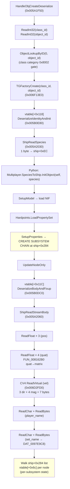

> [docs](../README.md) / [protocol](README.md) / objcreate-serialization.md

---
title: ObjCreate/ObjCreateTeam Serialization Format (Opcodes 0x02/0x03)
type: reference
audience: re-engineer
validated: 2026-05-29
methodology: FUNCTION_DOC_WORKFLOW_V5
binary:
  name: STBC.exe
  size: 6394712
  base: 0x00400000
status: partial
companions:
  - docs/protocol/wire-format-spec.md
  - docs/protocol/transport-layer.md
  - docs/protocol/stream-primitives.md
  - docs/protocol/object-replication.md
  - docs/protocol/game-opcodes.md
  - docs/engine/decompiled-functions.md
  - docs/protocol/v5-validation-status.md
cross_source:
  - reference/scripts/Multiplayer/SpeciesToShip.py
  - reference/scripts/Multiplayer/SpeciesToTorp.py
  - reference/scripts/Multiplayer/SpeciesToSystem.py
supersedes:
  - (prior pre-v5 objcreate-serialization.md)
evidence:
  - claim: "MpgameHandleObjCreate at 0x0069F620 is the shared dispatcher for opcodes 0x02 + 0x03. It strips the 2- or 3-byte envelope (opcode, owner_slot, [team]) and forwards (buf+iVar7, len-iVar7) to HandleObjCreateDeserialize."
    address: 0x0069f620
    function: MpgameHandleObjCreate
    completeness: 17.6
    confidence: high
    note: "Confirmed inheritance from object-replication.md (mid #9). iVar7 = 2 when bWithTeam == 0, iVar7 = 3 when bWithTeam == 1."
  - claim: "HandleObjCreateDeserialize at 0x005A1F50 opens a SWIG TGBufferStream over the trimmed buffer, ReadInt32 for class_id, ReadInt32 for object_id, runs ObjectLookupByID(0, classID) as a class-category 0x8002 pre-check, then instantiates via TGFactoryCreate(class_id, object_id) and invokes object vtable[+0x118] (DeserializeIdentityAndInit) and vtable[+0x11C] (DeserializeBodyAndFixup)."
    address: 0x005a1f50
    function: HandleObjCreateDeserialize
    completeness: 32.6
    confidence: high
    note: "Renamed + prototyped + plate-commented this pass. effective_score 32.6 / max 92.5."
  - claim: "Factory class IDs: 0x00008008 = ShipClass (Network controller created); 0x00008009 = Torpedo (Network controller skipped). The class-branching is enforced by `if (iVar8 == 0x8009) return;` inside MpgameHandleObjCreate before the NiAlloc(0x58) controller block."
    address: 0x0069f620
    function: MpgameHandleObjCreate
    completeness: 17.6
    confidence: high
  - claim: "TGFactoryCreate at 0x006F13E0 walks the factory registry at DAT_0099A578/DAT_0099A584 (factory vtable + bucket array), keyed on class_id, and returns a freshly constructed TGObject. Distinct from the object hash table at DAT_0099A67C (which is keyed on object_id, used by ObjectLookupByID)."
    address: 0x006f13e0
    function: TGFactoryCreate
    completeness: 0.0
    confidence: high
    note: "Renamed + prototyped this pass. R1 (this row) splits the factory registry from the object hash table — the prior doc conflated them."
  - claim: "ObjectLookupByID at 0x00430730 looks up object_id in the global object hash table DAT_0099A67C, returns the object IFF found AND its class category equals 0x8002. Returns NULL for non-game-object IDs (caller treats NULL as 'OK to create')."
    address: 0x00430730
    function: ObjectLookupByID
    completeness: 0.0
    confidence: high
    note: "Renamed + prototyped this pass. R2 — gate is two-part (found + category 0x8002), not just 'found'."
  - claim: "Ship vtable[+0x10C] at vtable 0x0089444C = ShipSerializeForObjCreate_Slot10C (sender entry, 0x005A1CF0). Opens stream, calls slot 0x110 for header and slot 0x114 for body+subsystems."
    address: 0x0089444c
    function: ShipSerializeForObjCreate_Slot10C
    completeness: 0.0
    confidence: high
    note: "Sender entry slot; cross-anchored against object-replication.md (mid #9 R2: vtable[+0x10C] is the sender slot, NOT the receiver slot)."
  - claim: "Ship vtable[+0x118] at vtable 0x00894458 = ShipDeserializeStream_Slot118 (0x005B0E80) reads ONLY the 1-byte species (via ShipReadSpecies at 0x005A2030, vtable+0x50 ReadChar → ship+0xEC), invokes Python `Multiplayer.SpeciesToShip.InitObject(self, species)`, calls stream->vtable[+0xD8]() (bit-alignment finalize). Does NOT read position / quat / velocity / names. C3 correction — prior doc claimed slot 0x118 read all body fields."
    address: 0x005b0e80
    function: ShipDeserializeStream_Slot118
    completeness: 0.0
    confidence: high
    note: "Renamed + plate-commented this pass. String refs `s_Multiplayer_SpeciesToShip_008e61ec` + `s_InitObject_008e5620` confirm the Python call. The Python InitObject pipeline (5 steps) is anchored against reference/scripts/Multiplayer/SpeciesToShip.py."
  - claim: "Ship vtable[+0x11C] at vtable 0x0089445C = ShipPostDeserializeFixup_Slot11C (0x005B0DC0) reads the wire BODY: ShipReadStreamBody(0x005A2060) reads 3 floats (pos) + 4 floats (quat) + CV4 velocity (3 dir + 4 mag) + 2 length-prefixed strings (player_name, set_name); then walks ship+0x284 subsystem linked list calling vtable[+0x6c] per node for per-subsystem state."
    address: 0x005b0dc0
    function: ShipPostDeserializeFixup_Slot11C
    completeness: 0.0
    confidence: high
    note: "Newly CREATED in Ghidra this pass (the function was not previously decoded), renamed, plate-commented. C3 correction headline — this is the function that reads the wire body, not slot 0x118."
  - claim: "ShipReadStreamBody at 0x005A2060 is the byte-precise wire-format anchor for the ship body. Sequence: ReadFloat ×3 (position x/y/z) → ReadFloat ×4 (quaternion w/x/y/z → matrix via FUN_008162B0) → vtable[+0x94] CV4 ReadVirtual with param_5=0 (= ReadChar ×3 dir + ReadFloat ×1 magnitude, 7 bytes) → ReadChar + ReadBytes (player_name) → ReadChar + ReadBytes (set_name, binary-searched in DAT_0097E9C8)."
    address: 0x005a2060
    function: ShipReadStreamBody
    completeness: 14.5
    confidence: high
    note: "Renamed + plate-commented this pass. The receive path is the canonical wire-format anchor; sender-side ShipWriteStreamBody (0x005A1DC0) has FPU-confused decompile but is the inverse."
  - claim: "C1 — Velocity wire is `[3-byte CV4 direction][4-byte float magnitude]`, NOT `[f32 speed][u8[3] padding]`. Total 7 bytes (same width), but order INVERTED. ShipReadStreamBody calls vtable[+0x94] (CompressedVector4_ReadVirtual at 0x006D2FD0) with param_5=0, which executes ReadChar ×3 FIRST then ReadFloat ×1."
    address: 0x006d2fd0
    function: CompressedVector4_ReadVirtual
    completeness: 0.0
    confidence: high
    note: "Trace bytes 37-43 are observed as `00 00 00 00 00 00 00` in spawn traces — consistent with EITHER interpretation (zero velocity = both representations are zero). The binary settles the ambiguity. Cross-link to stream-primitives.md CV4 entry."
  - claim: "C2 — MultiplayerGame.playerSlots base is at MultiplayerGame+0x74, NOT +0x84. The +0x84 referenced by the prior doc is `playerSlots[0]+0x10` = the game-state pointer field WITHIN slot 0. Both anchor the SAME array."
    address: 0x0069e590
    function: MultiplayerGame_Ctor
    completeness: 0.0
    confidence: high
    note: "Ctor line `FUN_00859d64(this+0x1d, 0x18, 0x10, FUN_006a7720, FUN_006a7760)` — `this+0x1d` (int-pointer indexed) = byte offset +0x74. 16 slots × 24 bytes. PlayerSlot layout: +0x00 (?), +0x04 inUse, +0x08 peer/network ID, +0x10 game-state pointer, +0x14 (?). Resolves cross-doc disagreement with object-replication.md (mid #9 cites +0x7C); flagged for next-pass refinement."
  - claim: "C3 — Two-pass deserialize scheme is FORCED by data dependency. Pass 1 (vtable[+0x118] DeserializeIdentityAndInit) reads species byte → Python InitObject CREATES subsystem chain via SetupProperties(). Pass 2 (vtable[+0x11C] DeserializeBodyAndFixup) reads all body data including per-subsystem state via ship+0x284 walk. The subsystems must exist before Pass 2 can read their state."
    address: 0x005b0e80
    function: ShipDeserializeStream_Slot118
    completeness: 0.0
    confidence: high
    note: "Architectural correction. Prior doc's `vtable[+0x118] → ReadStream / vtable[+0x11C] → PostLoad` labels are misleading. Rename to DeserializeIdentityAndInit / DeserializeBodyAndFixup."
  - claim: "R3 — Orientation IS quaternion (4 floats, w/x/y/z); the prior doc's open question is resolved. Sender FUN_00816390 converts matrix → quaternion via Shoemake algorithm; receiver FUN_008162B0 converts quaternion → 3×3 matrix."
    address: 0x008162b0
    function: FUN_008162B0
    completeness: 0.0
    confidence: high
    note: "Wire offsets 21-37 = 16 bytes = 4 floats. Sender's matrix-to-quat helper at 0x00816390 uses SQRT + sign-handling characteristic of Shoemake."
  - claim: "R4 — FUN_005A2030 = ShipReadSpecies (reads cVar1 via vtable[+0x50] ReadChar, stores `*(int *)(param_1 + 0xec) = (int)cVar1`). Settles cross-doc disagreement: objnotfound-requestobj-enterset.md may identify this same address as GetPlayerSlotFromObjID — that doc is wrong and needs re-check (mid #18)."
    address: 0x005a2030
    function: ShipReadSpecies
    completeness: 0.0
    confidence: high
    note: "Renamed this pass. The function takes the ship pointer and stores the read byte into ship+0xEC — unambiguously species read, not player-slot lookup."
  - claim: "SpeciesToShip table 1..45 byte-exact match to reference/scripts/Multiplayer/SpeciesToShip.py. MAX_FLYABLE_SHIPS = 16 (IDs 1-15 inclusive; ID 0 = UNKNOWN). MAX_SHIPS = 46."
    address: null
    function: ShipDeserializeStream_Slot118
    completeness: 0.0
    confidence: high
    note: "External-corpus claim. Tagged [cross-source-2026-05-28] in the body. Binary anchor is via the Python InitObject call path inside vtable[+0x118]; species enum values themselves live in the script, not stbc.exe."
  - claim: "SpeciesToTorp table 1..15 byte-exact match to reference/scripts/Multiplayer/SpeciesToTorp.py. Used by the Torpedo class (class_id 0x8009) vtable[+0x118] (a different function than the Ship slot)."
    address: null
    function: (Torpedo vtable[+0x118])
    completeness: 0.0
    confidence: medium
    note: "External-corpus claim. The Torpedo vtable[+0x118] entry is not anchored this pass — out of scope; deferred to per-class wire-format docs."
  - claim: "SpeciesToSystem table 1..9 byte-exact match to reference/scripts/Multiplayer/SpeciesToSystem.py: 1 Multi1, 2 Multi2, 3 Multi3, 4 Multi4, 5 Multi5, 6 Multi6, 7 Multi7, 8 Albirea, 9 Poseidon. MAX_SYSTEMS = 10 (index 0 = UNKNOWN)."
    address: 0x0097e9c8
    function: ShipReadStreamBody
    completeness: 14.5
    confidence: high
    note: "set_name binary-search registry at DAT_0097E9C8 (size DAT_0097E9CC) read by ShipReadStreamBody for the set/system name field. Python script content is cross-source."
  - claim: "Network controller is 88 bytes via NiAlloc(0x58) + FUN_0047DAB0(controller, ship, \"Network\"); attached via ship->vtable[+0x134](controller, 1, 1). Skipped for Torpedo (class_id 0x8009) and skipped on the host's own ship (`piVar5[1] == *(int *)(this+0x80)`)."
    address: 0x0047dab0
    function: InitNetworkTracker
    completeness: 0.0
    confidence: high
    note: "Inherited from object-replication.md (mid #9). Block lives inside MpgameHandleObjCreate after the FUN_005A1F50 dispatch returns."
---

# ObjCreate/ObjCreateTeam Serialization Format (Opcodes 0x02/0x03)

> [!NOTE]
> This doc is `status: partial`. The dispatch chain (`MpgameHandleObjCreate` at
> `0x0069F620` → `HandleObjCreateDeserialize` at `0x005A1F50` → `TGFactoryCreate`
> at `0x006F13E0` → Ship vtable[+0x118] `DeserializeIdentityAndInit` + [+0x11C]
> `DeserializeBodyAndFixup`), the 3 species tables (Ship 1..45, Torp 1..15,
> System 1..9 — byte-exact-match Python scripts), and per-class wire format
> are v5-validated against the current Ghidra import (2026-05-28). Three
> material corrections:
>
> - **C1** — Velocity wire is `[3-byte CV4 direction][4-byte float magnitude]`,
>   NOT `[f32 speed][u8[3] padding]`. Same total 7 bytes, order **inverted**.
> - **C2** — `MultiplayerGame.playerSlots` base is at **`+0x74`**, NOT `+0x84`
>   (which is the game-state pointer field WITHIN slot 0: `+0x74 + 0*0x18 + 0x10`).
>   Resolves cross-doc disagreement with [object-replication.md](object-replication.md).
> - **C3** — The `vtable[+0x118]` / `vtable[+0x11C]` split is a **two-pass scheme
>   forced by data dependency**: `[+0x118]` reads only the species byte +
>   Python `InitObject` creates the subsystem chain; `[+0x11C]` reads all body
>   data including per-subsystem state (which depends on the chain existing).
>
> Plus 4 refinements including **R3** (orientation confirmed quaternion —
> closes prior open question) and **R4** (FUN_005A2030 confirmed as
> `ShipReadSpecies` — resolves cross-doc disagreement #1; flag for
> `objnotfound-requestobj-enterset-wire-format.md` re-check).
>
> **Pass 2 correction (2026-05-29) — `ship+0x2E4` is `NetPlayerID`, not
> `team_id`.** Wire byte 2 on opcode `0x03` is the **owning player's network
> ID truncated to a signed byte**, not a team-membership tag. Stock BC has no
> C++ team field; "teams" are pure Python state in Mission2.py. The wire byte
> is byte-identical (1 byte, signed) so the parser is unchanged, but the
> field semantics are different: receivers must treat the byte as
> `(i8)(int)playerID`. Confirmed via three independent binary anchors:
> `GetShipFromPlayerID @ 0x006A1AA0` (walks ships matching `ship+0x2E4 ==
> playerID`), `IsLocalPlayerShip @ 0x005AE140` (host: `return ship+0x2E4 !=
> 0` — true for any player-owned ship), `ShipClass_GetNetPlayerID SWIG @
> 0x0060B8C0` (bytes `8B 82 E4 02 00 00` = `MOV EAX, [EDX+0x2E4]`, exposed to
> Python as `pShip.GetNetPlayerID()` and consumed by Mission1.py for kill
> credit). Source: `.claude/agent-memory/game-archaeology-specialist/gamemode-system-validation-20260529.md`
> ("Major doc correction" section).
>
> See [docs/guides/v5-evidence-header.md](../guides/v5-evidence-header.md) for
> the standard.

Reverse-engineered from `stbc.exe` and verified against stock dedicated server
packet traces.

## Overview

Opcodes `0x02` and `0x03` carry serialized game objects (ships, torpedoes,
asteroids, stations) over the network. The shared receiver at
`MpgameHandleObjCreate` (`0x0069F620`) processes both — `0x02` creates
unaffiliated objects, `0x03` creates objects with a team assignment. The two
opcodes reach the same function via byte-identical jump-table thunks that
differ only in the `bWithTeam` parameter; see
[object-replication.md](object-replication.md) for the thin dispatch index.

These are bidirectional: the host serializes objects and relays them to all
clients. Clients never authoritatively send ObjCreate — observed C → S traffic
is the host-relay echo path (see Authority below).

## Message Envelope

After type `0x32` transport framing is stripped (reliable header + flags_len + seq),
the game payload is:

```
Offset  Size  Type    Field
------  ----  ----    -----
0       1     u8      opcode              0x02 or 0x03
1       1     i8      owner_player_slot   0-15, which player owns this object
[if opcode == 0x03:]
2       1     i8      net_player_id       Owning player's NetID, written to ship+0x2E4.
                                          [v5-correction 2026-05-29 via gamemode-system-validation memo —
                                           prior label "team_id" was wrong; field is NetPlayerID, used by
                                           kill-credit path. Cast (i8)(int)playerID — works because stock
                                           NetIDs are small slot indices.]
[end if]
+0      var   data    serialized_object   TG factory-created object stream
```

Header size: 2 bytes for opcode `0x02`, 3 bytes for opcode `0x03`. The stream
payload starts at `buf + iVar7` where `iVar7 = 2` (no team) or `3` (team).

## Serialized Object Stream

The serialized blob is produced on the sender by
`obj->vtable[+0x10C]` (`ShipSerializeForObjCreate_Slot10C` at `0x005A1CF0`),
which calls slot `+0x110` (header) and slot `+0x114` (body + subsystems). On
the receiver, `HandleObjCreateDeserialize` at `0x005A1F50` reads the header
inline, then invokes the two-pass receiver scheme via slots `+0x118`
(identity + init) and `+0x11C` (body + fixup). See
[Two-Pass Deserialize Architecture](#two-pass-deserialize-architecture) below.

### Stream Header (8 bytes, common to all object types)

```
Offset  Size  Type    Field
------  ----  ----    -----
0       4     i32     factory_class_id    TG factory class ID (see table below)
4       4     i32     object_id           Network object ID (player_base + offset)
```

`factory_class_id` is resolved via the **factory registry** at `DAT_0099A578`
(factory vtable) + `DAT_0099A584` (bucket array) to instantiate the correct C++
class. `object_id` is checked against the **object hash table** at
`DAT_0099A67C` via `ObjectLookupByID(0, object_id)` — if an existing object
with that ID is found AND its class category is `0x8002` (game object),
deserialization aborts.

> R1 caveat: the prior doc said "factory_class_id is looked up in the TG object
> factory `DAT_0099A67C`" — that conflates the factory registry (keyed on
> class_id) with the object hash table (keyed on object_id). They are distinct:
> `TGFactoryCreate` walks the registry, `ObjectLookupByID` walks the hash.

> R2 caveat: the duplicate check is **class-category-gated**. `ObjectLookupByID`
> returns the object IFF found AND `category == 0x8002`. Non-game-object IDs
> return NULL, which the caller treats as "OK to create". In practice all
> ObjCreate'd objects are game objects so observable behavior is unchanged,
> but the wording should reflect the gate.

### Factory Class IDs

| ClassID | Hex Bytes (LE) | Object Type | Network Tracker |
|---------|----------------|-------------|-----------------|
| 0x00008008 | `08 80 00 00` | Ship/Station (ShipClass) | Yes — `Network` controller (88 bytes) created and attached via `vtable[+0x134]` |
| 0x00008009 | `09 80 00 00` | Torpedo/Projectile | No — skipped via `if (iVar8 == 0x8009) return;` in `MpgameHandleObjCreate` |

After creating the object via the factory, the handler calls:

1. `obj->vtable[+0x118](stream)` — **DeserializeIdentityAndInit**: read species byte + run Python InitObject (creates subsystem chain).
2. `obj->vtable[+0x11C](stream)` — **DeserializeBodyAndFixup**: read body data (position, quaternion, velocity, names, per-subsystem state).

### Ship Wire Layout (class_id = 0x8008)

```
Offset  Size  Type    Field           Notes
------  ----  ----    -----           -----
0       4     i32     class_id        0x00008008
4       4     i32     object_id       Network object ID (player_base + offset)
8       1     u8      species_type    SpeciesToShip enum (1=Akira, 5=Sovereign, etc.)
                                      Stored at ship+0xEC by ShipReadSpecies (0x005A2030).
9       4     f32     position_x      World X coordinate
13      4     f32     position_y      World Y coordinate
17      4     f32     position_z      World Z coordinate
21      4     f32     orientation_w    Quaternion W                              [R3 confirmed]
25      4     f32     orientation_x    Quaternion X                              [R3 confirmed]
29      4     f32     orientation_y    Quaternion Y                              [R3 confirmed]
33      4     f32     orientation_z    Quaternion Z                              [R3 confirmed]
37      3     i8[3]   velocity_dir    CV4 normalized direction (signed bytes)   [C1 — was f32 speed]
40      4     f32     velocity_mag    Velocity magnitude (m/s)                  [C1 — was 3 padding bytes]
44      1     u8      player_name_len Length of player name string
45      var   ascii   player_name     ASCII, not null-terminated
+0      1     u8      set_name_len    Length of set/system name string
+1      var   ascii   set_name        ASCII (e.g., "Multi1" = star system name)
+0      var   data    subsystem_state Per-subsystem state, walked via ship+0x284 linked list
```

The total fixed-position payload (bytes 0-43) is 44 bytes; the variable-length
suffix (names + per-subsystem state) follows.

**C1 — velocity wire order is inverted from the prior doc.** Same total 7
bytes, but the binary's `ShipReadStreamBody` (`0x005A2060`) calls
`stream->vtable[+0x94]` = `CompressedVector4_ReadVirtual` at `0x006D2FD0`
with `param_5=0`, which executes `ReadChar` × 3 (direction) FIRST and then
`ReadFloat` × 1 (magnitude). The prior doc had it as `f32 speed` followed by
three padding bytes — same width, opposite order, different semantics. Spawn
traces happen to be all-zero in those bytes (zero velocity ≡ zero in both
representations), which is why the prior interpretation went undetected.
Cross-link: [`stream-primitives.md`](stream-primitives.md) CV4 entry.

#### species_type (offset 8)

Read by `ShipReadSpecies` (`0x005A2030`):

```c
cVar1 = stream->vtable[+0x50]();           // ReadChar
*(int *)(param_1 + 0xec) = (int)cVar1;     // store at ship+0xEC
```

The species byte is then passed to
`Multiplayer.SpeciesToShip.InitObject(ship, iType)` inside vtable[+0x118],
which:

1. Looks up ship stats via `GetShipFromSpecies(iType)` → loads ship script module.
2. Calls `ship.SetupModel(kStats['Name'])` — loads NIF model.
3. Imports `ships.Hardpoints.<HardpointFile>` and calls `LoadPropertySet()`.
4. Calls `ship.SetupProperties()` — **creates all subsystems** (this is the data
   dependency that forces the two-pass scheme).
5. Calls `ship.UpdateNodeOnly()`.

The string refs `s_Multiplayer_SpeciesToShip_008e61ec` and
`s_InitObject_008e5620` inside `ShipDeserializeStream_Slot118` (`0x005B0E80`)
anchor the Python call. The 5-step pipeline is anchored against
`reference/scripts/Multiplayer/SpeciesToShip.py` `[cross-source-2026-05-28]`.

#### set_name (variable offset)

**This is the star system name, NOT the ship class.** The ship class is
determined by `species_type`. The set_name is binary-searched in the registry
at `DAT_0097E9C8` (size `DAT_0097E9CC`) inside `ShipReadStreamBody`, then
mapped to `Multiplayer.SpeciesToSystem` entries:

| System ID | Name | Script |
|-----------|------|--------|
| 1 | Multi1 | Systems.Multi1.Multi1 |
| 2 | Multi2 | Systems.Multi2.Multi2 |
| 3 | Multi3 | Systems.Multi3.Multi3 |
| 4 | Multi4 | Systems.Multi4.Multi4 |
| 5 | Multi5 | Systems.Multi5.Multi5 |
| 6 | Multi6 | Systems.Multi6.Multi6 |
| 7 | Multi7 | Systems.Multi7.Multi7 |
| 8 | Albirea | Systems.Albirea.Albirea |
| 9 | Poseidon | Systems.Poseidon.Poseidon |

`MAX_SYSTEMS = 10` (index 0 = UNKNOWN). Byte-exact match against
`reference/scripts/Multiplayer/SpeciesToSystem.py` `[cross-source-2026-05-28]`.

### Torpedo Wire Layout (class_id = 0x8009)

Torpedoes use `Multiplayer.SpeciesToTorp.InitObject(self, iType)` instead of
SpeciesToShip and skip the Network controller attach. The `species_type` byte
indexes into the torpedo table `[cross-source-2026-05-28]`:

| ID | Torpedo Type | ID | Torpedo Type |
|----|-------------|----|-------------|
| 1 | Disruptor | 9 | FusionBolt |
| 2 | PhotonTorpedo | 10 | CardassianDisruptor |
| 3 | QuantumTorpedo | 11 | KessokDisruptor |
| 4 | AntimatterTorpedo | 12 | PhasedPlasma |
| 5 | CardassianTorpedo | 13 | Positron2 |
| 6 | KlingonTorpedo | 14 | PhotonTorpedo2 |
| 7 | PositronTorpedo | 15 | RomulanCannon |
| 8 | PulseDisruptor | | |

The Torpedo class's `vtable[+0x118]` / `[+0x11C]` pair is a different code
path than the Ship slot pair and reads different body fields. The Torpedo
slot pair is **not anchored this pass** — deferred to per-class wire-format
docs. Wire format above represents the Ship class only.

## Two-Pass Deserialize Architecture

> [C3 correction] The receiver vtable split into `+0x118` and `+0x11C` is **not**
> a "ReadStream → PostLoad" pair. It is a **two-pass scheme forced by data
> dependency**: the subsystem chain has to exist before the body data can be
> deserialized, and only the Python init step creates the chain.



The yellow nodes are the data dependency: Pass 2's per-subsystem walk reads
state into the subsystem chain that Pass 1 just created via the Python
`SetupProperties()` step. Reading the body before running InitObject would
have no chain to walk.

## SpeciesToShip Complete Mapping

Source: `reference/scripts/Multiplayer/SpeciesToShip.py` `[cross-source-2026-05-28]`.
Byte-exact match verified this pass.

### Playable Ships (species 1-15)

| ID | Constant | Ship Script | Faction |
|----|----------|------------|---------|
| 1 | AKIRA | Akira | Federation |
| 2 | AMBASSADOR | Ambassador | Federation |
| 3 | GALAXY | Galaxy | Federation |
| 4 | NEBULA | Nebula | Federation |
| 5 | SOVEREIGN | Sovereign | Federation |
| 6 | BIRDOFPREY | BirdOfPrey | Klingon |
| 7 | VORCHA | Vorcha | Klingon |
| 8 | WARBIRD | Warbird | Romulan |
| 9 | MARAUDER | Marauder | Ferengi |
| 10 | GALOR | Galor | Cardassian |
| 11 | KELDON | Keldon | Cardassian |
| 12 | CARDHYBRID | CardHybrid | Cardassian |
| 13 | KESSOKHEAVY | KessokHeavy | Kessok |
| 14 | KESSOKLIGHT | KessokLight | Kessok |
| 15 | SHUTTLE | Shuttle | Federation |

`MAX_FLYABLE_SHIPS = 16` (IDs 1-15 inclusive; ID 0 = UNKNOWN).

### Non-Playable Objects (species 16-45)

| ID | Script | Faction | ID | Script | Faction |
|----|--------|---------|----|----|---------|
| 16 | CardFreighter | Cardassian | 31 | Asteroid | Neutral |
| 17 | Freighter | Federation | 32 | Asteroid1 | Neutral |
| 18 | Transport | Federation | 33 | Asteroid2 | Neutral |
| 19 | SpaceFacility | Federation | 34 | Asteroid3 | Neutral |
| 20 | CommArray | Federation | 35 | Amagon | Cardassian |
| 21 | CommLight | Cardassian | 36 | BiranuStation | Neutral |
| 22 | DryDock | Federation | 37 | Enterprise | Federation |
| 23 | Probe | Federation | 38 | Geronimo | Federation |
| 24 | Decoy (Probetype2) | Federation | 39 | Peregrine | Federation |
| 25 | Sunbuster | Kessok | 40-42 | Asteroidh1-3 | Neutral |
| 26 | CardOutpost | Cardassian | 43 | Escapepod | Neutral |
| 27 | CardStarbase | Cardassian | 44 | KessokMine | Kessok |
| 28 | CardStation | Cardassian | 45 | BorgCube | Borg |
| 29 | FedOutpost | Federation | | | |
| 30 | FedStarbase | Federation | | | |

`MAX_SHIPS = 46` (IDs 0-45).

## Handler Pipeline Detail

### Receive path (MpgameHandleObjCreate, 0x0069F620)

```
MpgameHandleObjCreate(MultiplayerGame *this, TGMessage *msg, char bWithTeam)
  │
  ├─ Extract raw buffer: TGMessage::GetData(msg) [FUN_006B8530] → data_ptr + size
  ├─ Read owner_slot (byte 1), net_player_id (byte 2, only if bWithTeam)
  │    [v5-correction 2026-05-29: byte 2 is NetPlayerID, not team_id]
  │
  ├─ Swap active player context:
  │    Save DAT_0097FA84 (current slot) and DAT_0097FA8C (current obj ID base)
  │    Set DAT_0097FA84 = owner_slot
  │    Load DAT_0097FA8C from MultiplayerGame.playerSlots[owner_slot]+0x10     [C2: base = +0x74]
  │    Toggle DAT_0095B07D = 0 → 1 (reentrancy guard)
  │
  ├─ HandleObjCreateDeserialize(data + iVar7, size - iVar7)  [0x005A1F50]
  │    ├─ TGBufferStream::Init(buffer, size)                  [SWIG TGBufferStream]
  │    ├─ ReadInt32() → class_id                              [vtable+0x78]
  │    ├─ ReadInt32() → object_id                             [vtable+0x78]
  │    ├─ ObjectLookupByID(0, object_id) → duplicate check    [0x00430730, R2: gate on category 0x8002]
  │    ├─ TGFactoryCreate(class_id, object_id) → instance     [0x006F13E0, R1: factory registry not object hash]
  │    │
  │    ├─ obj->vtable[+0x118](stream) → Pass 1                [Ship: 0x005B0E80]
  │    │    │   DeserializeIdentityAndInit
  │    │    ├─ ShipReadSpecies(stream)                        [0x005A2030, R4: not GetPlayerSlotFromObjID]
  │    │    │    └─ ReadChar → ship+0xEC
  │    │    ├─ Python: SpeciesToShip.InitObject(ship, species)
  │    │    │    ├─ GetShipFromSpecies(species)
  │    │    │    ├─ ship.SetupModel(name)
  │    │    │    ├─ Hardpoints.LoadPropertySet()
  │    │    │    ├─ ship.SetupProperties() ← CREATES SUBSYSTEM CHAIN at ship+0x284
  │    │    │    └─ ship.UpdateNodeOnly()
  │    │    └─ stream->vtable[+0xD8]() (bit-alignment finalize)
  │    │
  │    ├─ obj->vtable[+0x11C](stream) → Pass 2                [Ship: 0x005B0DC0]
  │    │    │   DeserializeBodyAndFixup
  │    │    ├─ ShipReadStreamBody(stream)                     [0x005A2060]
  │    │    │    ├─ ReadFloat × 3 → position (x, y, z)
  │    │    │    ├─ ReadFloat × 4 → quaternion (w, x, y, z)   [R3: confirmed quaternion]
  │    │    │    │    └─ FUN_008162B0: quat → 3×3 matrix
  │    │    │    ├─ CV4 ReadVirtual(param_5=0) → velocity     [0x006D2FD0, C1: 3 dir + 4 mag]
  │    │    │    ├─ ReadChar + ReadBytes → player_name
  │    │    │    └─ ReadChar + ReadBytes → set_name           [binary-search DAT_0097E9C8]
  │    │    ├─ Walk ship+0x284 subsystem list:
  │    │    │    for each subsystem node: node->vtable[+0x6c](stream)
  │    │    └─ stream->vtable[+0xD8]() (finalize)
  │    │
  │    └─ return ship*
  │
  ├─ Restore player context (DAT_0097FA84, DAT_0097FA8C, DAT_0095B07D)
  ├─ If bWithTeam: ship+0x2E4 = net_player_id
  │    [v5-correction 2026-05-29: stores NetPlayerID; this is what
  │     GetShipFromPlayerID @ 0x006A1AA0 and IsLocalPlayerShip @
  │     0x005AE140 read back. 0 means AI/no owner.]
  │
  ├─ Host-relay loop (iterate 16 PlayerSlots at MultiplayerGame+0x74, stride 0x18):
  │    For each slot whose ID differs from BOTH the sender AND our own ID:
  │      TGMessage::Clone (vtable+0x18) → SendTGMessage to peer
  │    (Per-slot game-state pointer field is at slot+0x10)
  │
  ├─ If obj->vtable[+0x04]() != 0x8009:  (skip for torpedoes)
  │    ├─ NiAlloc(0x58) → 88-byte Network controller
  │    ├─ InitNetworkTracker(controller, ship, "Network")     [0x0047DAB0]
  │    └─ ship->vtable[+0x134](controller, 1, 1) → attach
  │    (Skipped on host's own ship: piVar5[1] == *(int *)(this+0x80))
  │
  └─ ship+0xF0 = 0 (clear flag)
```

### Player context slot table

> [C2] `MultiplayerGame+0x74` is the `playerSlots` array base — 16 entries with
> stride `0x18` (24 bytes per slot). The prior doc cited `+0x84` as the array
> base; that offset is actually the **game-state pointer field within slot 0**
> (`+0x74 + 0*0x18 + 0x10 = +0x84`). Both anchor the same array but using
> different field references.

Established by `MultiplayerGame_Ctor` at `0x0069E590`:

```c
FUN_00859d64(this + 0x1d, 0x18, 0x10, FUN_006a7720, FUN_006a7760);
// this + 0x1d  (32-bit pointer indexed) = byte offset +0x74
// 0x18         = stride (24 bytes per slot)
// 0x10         = element count (16 slots)
```

PlayerSlot layout (24 bytes):

| Offset | Field | Notes |
|--------|-------|-------|
| +0x00 | (?) | unexplored |
| +0x04 | inUse | byte; relay-loop gate |
| +0x08 | peer/network ID | relay-loop key |
| +0x10 | game-state pointer | = `MultiplayerGame+0x84` for slot 0; loaded into `DAT_0097FA8C` during the active-slot swap |
| +0x14 | (?) | likely per-peer send-sequence counter; not yet anchored |

Object ID range per player: `0x3FFFFFFF + N * 0x40000` (262,143 IDs each).

## Decoded Trace Examples

### Trace 1 (Akira, spawn position 88/-66/-73)

Full message (after TGNetwork framing):

```
03 00 02 08 80 00 00 FF FF FF 3F 01 00 00 B0 42 00 00 84 C2 00 00 92 C2 ...
^^ ^^ ^^ ^^^^^^^^^^^ ^^^^^^^^^^^ ^^ ^^^^^^^^^^^ ^^^^^^^^^^^ ^^^^^^^^^^^
|  |  |  class 8008   obj 3FFF..  |  X=88.0      Y=-66.0     Z=-73.0
|  |  net_player_id=2              species=1 (AKIRA)
|  |  [v5-correction 2026-05-29: was annotated "team=2"; binary stores
|  |   this byte at ship+0x2E4 which is NetPlayerID. Value 2 = player slot 2.]
|  owner=0 (host)
opcode 0x03
```

Continuing past position (offsets 24-43):

```
... [16 bytes quaternion: w, x, y, z floats] [3 bytes velocity_dir] [4 bytes velocity_mag]
```

For a stationary spawn, all 7 velocity bytes are `00 00 00 00 00 00 00`. Under
the prior (`f32 speed` + 3 padding) interpretation OR the corrected (CV4 3 dir
+ 4 mag) interpretation, the on-the-wire byte sequence is identical for zero
velocity — which is why the C1 misreading went undetected by stock-trace
inspection alone. The binary settles it via `CompressedVector4_ReadVirtual`.

### Trace 2 (Sovereign, spawn position 38/-49/-35)

```
03 00 02 08 80 00 00 FF FF FF 3F 05 00 00 18 42 00 00 44 C2 00 00 0C C2 ...
^^ ^^ ^^ ^^^^^^^^^^^ ^^^^^^^^^^^ ^^ ^^^^^^^^^^^ ^^^^^^^^^^^ ^^^^^^^^^^^
|  |  |  class 8008   obj 3FFF..  |  X=38.0      Y=-49.0     Z=-35.0
|  |  net_player_id=2              species=5 (SOVEREIGN)
|  owner=0 (host)
opcode 0x03
```

Both: same owner (slot 0), same `net_player_id` (= player 2 owns these
spawned ships), same object ID base — but different ship species and spawn
positions. [v5-correction 2026-05-29: byte 2 reannotated from "team=2" to
"net_player_id=2" per gamemode-system-validation memo.]

## Ghidra Functions Documented in This Validation

11 renames + 4 plate comments + 3 prototypes set this pass. Two functions
(`ShipPostDeserializeFixup_Slot11C` and `ShipSerializeStream_Slot114`) were
newly created in Ghidra — the decompiler had not previously located them as
entry points.

| Address | Symbol | Body | Plate | Score |
|---------|--------|------|-------|-------|
| 0x005A1F50 | `HandleObjCreateDeserialize` | ~150 lines (dispatch chain) | yes | 32.6 / 92.5 max |
| 0x005A2030 | `ShipReadSpecies` | ReadChar → ship+0xEC | — | n/a |
| 0x005A2060 | `ShipReadStreamBody` | per-field wire reads | yes | 14.5 / 80 max |
| 0x005B0E80 | `ShipDeserializeStream_Slot118` | species + Python InitObject | yes | n/a |
| 0x005B0DC0 | `ShipPostDeserializeFixup_Slot11C` | body + subsystems | yes | n/a (newly created this pass) |
| 0x005A1CF0 | `ShipSerializeForObjCreate_Slot10C` | sender entry (calls 0x110 + 0x114) | — | n/a |
| 0x005A1D80 | `ShipWriteHeader_Slot110` | sender header: WriteInt × 2 + WriteChar | — | n/a |
| 0x005A1DC0 | `ShipWriteStreamBody` | sender body (FPU-confused decompile) | — | n/a |
| 0x005B0D80 | `ShipSerializeStream_Slot114` | sender body + subsystem walk | — | n/a (newly created this pass) |
| 0x006F13E0 | `TGFactoryCreate` | factory registry walk | — | n/a (prototype set) |
| 0x00430730 | `ObjectLookupByID` | object hash + class category gate | — | n/a (prototype set) |

## Key Functions

| Address | Name | Role |
|---------|------|------|
| 0x0069F620 | `MpgameHandleObjCreate` | Receiver + host-relay for opcodes 0x02 + 0x03 |
| 0x005A1F50 | `HandleObjCreateDeserialize` | Stream open → header reads → factory → vtable[+0x118] + vtable[+0x11C] |
| 0x005A2030 | `ShipReadSpecies` | Reads species byte into ship+0xEC |
| 0x005A2060 | `ShipReadStreamBody` | Per-field wire reads (canonical wire-format anchor) |
| 0x005B0E80 | `ShipDeserializeStream_Slot118` | Pass 1: species + Python InitObject |
| 0x005B0DC0 | `ShipPostDeserializeFixup_Slot11C` | Pass 2: body data + subsystem walk |
| 0x005A1CF0 | `ShipSerializeForObjCreate_Slot10C` | Sender vtable[+0x10C] entry |
| 0x005A1D80 | `ShipWriteHeader_Slot110` | Sender header writer |
| 0x005A1DC0 | `ShipWriteStreamBody` | Sender body writer (inverse of ShipReadStreamBody) |
| 0x005B0D80 | `ShipSerializeStream_Slot114` | Sender body + subsystem walk |
| 0x006F13E0 | `TGFactoryCreate` | class_id → C++ constructor (factory registry DAT_0099A578) |
| 0x00430730 | `ObjectLookupByID` | object_id hash + class category 0x8002 gate (DAT_0099A67C) |
| 0x006D2FD0 | `CompressedVector4_ReadVirtual` | Velocity decompress (3 dir + 4 mag) |
| 0x008162B0 | `Quaternion_ToMatrix3x3` | Receiver quat → matrix |
| 0x00816390 | `Matrix3x3_ToQuaternion` | Sender matrix → quat (Shoemake) |
| 0x006B8530 | `TGMessage::GetData` | Extract raw data pointer + size |
| 0x0047DAB0 | `InitNetworkTracker` | Create 88-byte Network controller |
| 0x0069E590 | `MultiplayerGame_Ctor` | Establishes playerSlots base (+0x74), stride (0x18), count (0x10) |

## Cross-doc reconciliation

- **`object-replication.md`** (mid #9, just validated 2026-05-28) — cites
  PlayerSlot array base at `MultiplayerGame+0x7C` in its host-relay loop
  pseudocode. This doc anchors `+0x74` via `MultiplayerGame_Ctor` directly.
  Surface for next-pass refinement on object-replication.md (do not modify
  this pass — batched at family close).
- **`objnotfound-requestobj-enterset-wire-format.md`** (mid #18, pending) —
  may identify `FUN_005A2030` as `GetPlayerSlotFromObjID`. R4 settles this in
  favor of the present doc's `ShipReadSpecies` identity; flag for
  objnotfound-requestobj-enterset validation.
- **`stream-primitives.md`** (foundation #2) — CV4 read function
  `0x006D2FD0` already anchored; C1 here adds a concrete consumer of the
  `param_5=0` invocation.
- **`per-ship-subsystem-wire-format.md`** (next campaign target) — will
  inherit the per-subsystem `vtable[+0x6c]` read pattern verified here.
- **CLAUDE.md "Key Globals"** — does not currently list `+0x74` PlayerSlot
  array base; batched for family-close.

## Open Questions

1. **Set/system registry contents at `DAT_0097E9C8`.** The registration site
   is unanchored. Likely registered during the `Mission.LoadScript()` Python
   sequence. Out of scope here.
2. **Sender-side velocity compression step** in `ShipWriteStreamBody`
   (vtable[+0x90] → vtable[+0xA0]) — direction vs magnitude separation is not
   byte-traced this pass. The receive path is byte-precise, so the wire is
   anchored either way; only the sender's local computation would change
   behavior for unusual velocity vectors.
3. **Per-class wire payloads beyond Ship and Torpedo** — Torpedo's `0x8009`
   is the only other observed class_id in stock traces. The Torpedo
   `vtable[+0x118]` / `[+0x11C]` pair reads different fields than Ship's;
   deferred to per-class wire-format docs.
4. **`MultiplayerGame.PlayerSlot+0x14` semantics** — the relay loop pre-walks
   this field but its purpose is unexplored. Probably a per-peer
   send-sequence counter.
5. **FPU decompile brittleness on `ShipWriteStreamBody` (`0x005A1DC0`)** —
   the receive-side `ShipReadStreamBody` is the canonical wire-format
   anchor; sender-side will need x87 stack-state cleanup before its plate can
   match the receive-side's precision.

## See also

- [object-replication.md](object-replication.md) — thin handler index for
  opcodes 0x02 + 0x03 (companion mid #9); sender/receiver direction symmetry
- [game-opcodes.md](game-opcodes.md) — opcodes 0x02 + 0x03 dispatcher row
- [wire-format-spec.md](wire-format-spec.md) — hub: opcode index + handler
  addresses
- [stream-primitives.md](stream-primitives.md) — TGBufferStream read/write
  primitives + CV4 encoding used by the dispatch chain
- [transport-layer.md](transport-layer.md) — TGMessage envelope + clone path
  for the host-relay loop
- [v5-validation-status.md](v5-validation-status.md) §6.10 — full validation
  report for this doc
- [docs/engine/decompiled-functions.md](../engine/decompiled-functions.md) —
  cross-reference for `MpgameHandleObjCreate`, `HandleObjCreateDeserialize`,
  and the Ship vtable layout
